# 🏥 HMS Frontend & UI/UX — Complete AI Coding Implementation Guide

> **Platform**: Multi-Tenant SaaS Hospital Management System (India)
> **Stack**: Flutter (Mobile) + Next.js/React + Ant Design (Web)
> **Theme**: Healthcare Green — Primary Teal `#0D9488` · Dark Slate `#0F172A` · Emerald `#059669`
> **Compliance**: ABDM FHIR R4 · DPDP Act 2023 · GST · NABH/NABL
> **Version**: Phase 1 MVP End-to-End

---

## 📋 Table of Contents

1. [Design System & Token Foundation](#1-design-system--token-foundation)
2. [Project Structure & Routing](#2-project-structure--routing)
3. [Authentication & Onboarding Flows](#3-authentication--onboarding-flows)
4. [Super Admin Portal](#4-super-admin-portal)
5. [Hospital Admin Portal](#5-hospital-admin-portal)
6. [Reception & Front Desk](#6-reception--front-desk)
7. [Doctor Clinical Workspace (EHR/EMR)](#7-doctor-clinical-workspace-ehremr)
8. [Nurse & IPD Workspace](#8-nurse--ipd-workspace)
9. [OT Management UI](#9-ot-management-ui)
10. [Pharmacy Dispensing](#10-pharmacy-dispensing)
11. [Laboratory & Radiology](#11-laboratory--radiology)
12. [Billing & TPA Management](#12-billing--tpa-management)
13. [Inpatient (IPD) Module](#13-inpatient-ipd-module)
14. [Patient Portal & ABHA](#14-patient-portal--abha)
15. [HR, Payroll & Shift Management](#15-hr-payroll--shift-management)
16. [Compliance & Audit Dashboard](#16-compliance--audit-dashboard)
17. [Notification Center](#17-notification-center)
18. [Print Templates](#18-print-templates)
19. [Flutter Mobile App — Screen Inventory](#19-flutter-mobile-app--screen-inventory)
20. [Shared Component Library](#20-shared-component-library)
21. [PWA & Offline Capability](#21-pwa--offline-capability)
22. [Accessibility & i18n](#22-accessibility--i18n)
23. [Testing & QA Checklist](#23-testing--qa-checklist)

---

## 1. Design System & Token Foundation

### 1.1 Color Palette (Green/Teal Healthcare Theme)

| Token | Hex | Usage |
|---|---|---|
| `primary-teal` | `#0D9488` | Primary CTA, active nav, key actions |
| `dark-teal` | `#0F766E` | Hover states on primary |
| `emerald-green` | `#059669` | Success states, "Normal" vitals |
| `light-teal-bg` | `#F0FDFA` | Page backgrounds, sidebar fills |
| `soft-cyan` | `#E0F2FE` | Info banners, patient cards |
| `dark-slate` | `#0F172A` | App bars, headers, sidebar |
| `slate-700` | `#334155` | Body text |
| `slate-400` | `#94A3B8` | Placeholder / hint text |
| `white-card` | `#FFFFFF` | Card backgrounds |
| `bg-grey` | `#F8FAFC` | Page scaffold background |
| `alert-crimson` | `#E11D48` | Errors, STAT alerts, allergy warnings |
| `warning-amber` | `#F59E0B` | Warnings, pending states |
| `info-blue` | `#0EA5E9` | Info tags, ABHA badges |
| `purple-accent` | `#7C3AED` | AI-generated note indicators |

### 1.2 Typography (Google Fonts: Inter)

```
H1  — Inter Bold 32px / line-height 40px   — Page titles
H2  — Inter SemiBold 24px / line-height 32px — Section headings
H3  — Inter SemiBold 18px / line-height 28px — Card headings
H4  — Inter Medium 16px / line-height 24px  — Subsection labels
Body — Inter Regular 14px / line-height 22px — Default content
Small — Inter Regular 12px / line-height 18px — Labels, timestamps
Mono — JetBrains Mono 13px                  — Lab values, IDs, drug codes
```

### 1.3 Spacing & Grid System

- **Base unit**: 4px
- **Spacing scale**: 4 · 8 · 12 · 16 · 20 · 24 · 32 · 48 · 64px
- **Card radius**: 12px standard · 8px compact · 16px modal
- **Grid**: 12-column responsive (`xs:1 col`, `sm:2 col`, `md:3 col`, `lg:4 col`)
- **Max content width**: 1440px with `auto` margins

### 1.4 Ant Design Theme Tokens (Next.js/React Web)

```typescript
// theme/antd-tokens.ts
export const hmsThemeTokens = {
  token: {
    colorPrimary: '#0D9488',
    colorSuccess: '#059669',
    colorWarning: '#F59E0B',
    colorError: '#E11D48',
    colorInfo: '#0EA5E9',
    colorBgBase: '#F8FAFC',
    colorBgContainer: '#FFFFFF',
    colorText: '#334155',
    colorTextSecondary: '#64748B',
    borderRadius: 8,
    fontFamily: "'Inter', 'Roboto', sans-serif",
    fontSize: 14,
    lineHeight: 1.6,
    colorBorder: '#E2E8F0',
    boxShadow: '0 1px 3px rgba(0,0,0,0.08)',
    controlHeight: 40,
    controlHeightLG: 48,
  },
  components: {
    Button: { colorPrimary: '#0D9488', algorithm: true },
    Menu: { colorItemBgSelected: '#F0FDFA', colorItemTextSelected: '#0D9488' },
    Table: { colorFillAlter: '#F8FAFC', headerBg: '#F1FDF9' },
    Tag: { borderRadius: 20 },
    Badge: { colorBgBase: '#E11D48' },
  }
};
```

### 1.5 Flutter Theme Tokens (Mobile App)

```dart
// core/theme/app_theme.dart — EXTEND THIS
class AppTheme {
  // Base Colors
  static const Color primaryTeal   = Color(0xFF0D9488);
  static const Color darkTeal      = Color(0xFF0F766E);
  static const Color emeraldGreen  = Color(0xFF059669);
  static const Color lightTealBg   = Color(0xFFF0FDFA);
  static const Color softCyan      = Color(0xFFE0F2FE);
  static const Color darkSlate     = Color(0xFF0F172A);
  static const Color slate700      = Color(0xFF334155);
  static const Color slate400      = Color(0xFF94A3B8);
  static const Color alertCrimson  = Color(0xFFE11D48);
  static const Color warningAmber  = Color(0xFFF59E0B);
  static const Color infoBlue      = Color(0xFF0EA5E9);
  static const Color purpleAccent  = Color(0xFF7C3AED);
  static const Color backgroundGrey = Color(0xFFF8FAFC);

  // Semantic Role Colors
  static const Color statAlert     = Color(0xFFE11D48);  // Critical
  static const Color vitalNormal   = Color(0xFF059669);  // In range
  static const Color vitalAbnormal = Color(0xFFF59E0B);  // Out of range
  static const Color aiGenerated   = Color(0xFF7C3AED);  // AI badge

  // Spacing
  static const double spacingXS = 4.0;
  static const double spacingSM = 8.0;
  static const double spacingMD = 16.0;
  static const double spacingLG = 24.0;
  static const double spacingXL = 32.0;

  // Border Radius
  static const double radiusSM  = 8.0;
  static const double radiusMD  = 12.0;
  static const double radiusLG  = 16.0;
  static const double radiusXL  = 24.0;
}
```

### 1.6 Icon Library

- **Web**: Ant Design Icons + Lucide Icons (medical set)
- **Mobile Flutter**: `flutter_svg` + custom medical icon set
- Key icon categories: `stethoscope`, `pill`, `syringe`, `bed`, `clipboard-cross`, `microscope`, `heart-pulse`, `qr-code`, `shield-check`

---

## 2. Project Structure & Routing

### 2.1 Next.js Web — App Router Directory Layout

```
frontend/
├── app/
│   ├── (auth)/
│   │   ├── login/page.tsx
│   │   └── forgot-password/page.tsx
│   ├── (super-admin)/
│   │   ├── layout.tsx
│   │   ├── tenants/page.tsx
│   │   ├── tenants/[id]/page.tsx
│   │   ├── subscriptions/page.tsx
│   │   ├── feature-flags/page.tsx
│   │   ├── global-masters/drugs/page.tsx
│   │   ├── global-masters/icd10/page.tsx
│   │   ├── global-masters/snomed/page.tsx
│   │   ├── global-masters/loinc/page.tsx
│   │   ├── global-masters/lab-tests/page.tsx
│   │   ├── audit-logs/page.tsx
│   │   └── support-tickets/page.tsx
│   ├── (hospital-admin)/
│   │   ├── layout.tsx
│   │   ├── dashboard/page.tsx
│   │   ├── settings/page.tsx
│   │   ├── departments/page.tsx
│   │   ├── wards/page.tsx
│   │   ├── beds/page.tsx
│   │   ├── users/page.tsx
│   │   ├── users/[id]/page.tsx
│   │   ├── roles/page.tsx
│   │   ├── print-templates/page.tsx
│   │   └── accreditations/page.tsx
│   ├── (reception)/
│   │   ├── layout.tsx
│   │   ├── dashboard/page.tsx
│   │   ├── registration/page.tsx
│   │   ├── registration/[uhid]/page.tsx
│   │   ├── appointments/page.tsx
│   │   ├── appointments/new/page.tsx
│   │   ├── queue/page.tsx
│   │   └── token-display/page.tsx
│   ├── (doctor)/
│   │   ├── layout.tsx
│   │   ├── dashboard/page.tsx
│   │   ├── opd-queue/page.tsx
│   │   ├── encounter/[id]/page.tsx
│   │   ├── encounter/[id]/vitals/page.tsx
│   │   ├── encounter/[id]/soap/page.tsx
│   │   ├── encounter/[id]/diagnosis/page.tsx
│   │   ├── encounter/[id]/prescription/page.tsx
│   │   ├── encounter/[id]/referral/page.tsx
│   │   ├── teleconsult/[id]/page.tsx
│   │   └── payout-summary/page.tsx
│   ├── (nurse)/
│   │   ├── layout.tsx
│   │   ├── dashboard/page.tsx
│   │   ├── ward-view/page.tsx
│   │   ├── patient/[admissionId]/vitals/page.tsx
│   │   ├── patient/[admissionId]/mar/page.tsx
│   │   ├── patient/[admissionId]/nursing-notes/page.tsx
│   │   ├── patient/[admissionId]/diet/page.tsx
│   │   └── shift-handover/page.tsx
│   ├── (ot)/
│   │   ├── layout.tsx
│   │   ├── schedule/page.tsx
│   │   ├── bookings/[id]/page.tsx
│   │   └── checklist/[id]/page.tsx
│   ├── (pharmacy)/
│   │   ├── layout.tsx
│   │   ├── dashboard/page.tsx
│   │   ├── dispense/page.tsx
│   │   ├── inventory/page.tsx
│   │   ├── stock-batches/page.tsx
│   │   ├── purchase-orders/page.tsx
│   │   └── controlled-drugs/page.tsx
│   ├── (lab)/
│   │   ├── layout.tsx
│   │   ├── dashboard/page.tsx
│   │   ├── orders/page.tsx
│   │   ├── sample-collection/page.tsx
│   │   ├── result-entry/[orderId]/page.tsx
│   │   └── report-view/[reportId]/page.tsx
│   ├── (radiology)/
│   │   ├── layout.tsx
│   │   ├── orders/page.tsx
│   │   └── report-entry/[orderId]/page.tsx
│   ├── (billing)/
│   │   ├── layout.tsx
│   │   ├── dashboard/page.tsx
│   │   ├── invoices/page.tsx
│   │   ├── invoices/new/page.tsx
│   │   ├── invoices/[id]/page.tsx
│   │   ├── payments/page.tsx
│   │   ├── tpa-claims/page.tsx
│   │   ├── tpa-claims/[id]/page.tsx
│   │   ├── discount-approvals/page.tsx
│   │   └── gst-reports/page.tsx
│   ├── (hr)/
│   │   ├── layout.tsx
│   │   ├── staff/page.tsx
│   │   ├── shifts/page.tsx
│   │   ├── rosters/page.tsx
│   │   ├── leave/page.tsx
│   │   ├── attendance/page.tsx
│   │   └── payroll/page.tsx
│   ├── (compliance)/
│   │   ├── layout.tsx
│   │   ├── audit-logs/page.tsx
│   │   ├── consents/page.tsx
│   │   └── dpdp-report/page.tsx
│   ├── (patient-portal)/
│   │   ├── layout.tsx
│   │   ├── my-records/page.tsx
│   │   ├── appointments/page.tsx
│   │   ├── prescriptions/page.tsx
│   │   └── abha-link/page.tsx
│   └── api/ (Next.js API routes — BFF layer)
├── components/
│   ├── ui/            ← Shared atomic components
│   ├── forms/         ← Form primitives (masked inputs etc.)
│   ├── layout/        ← Sidebar, TopBar, PageWrapper
│   ├── tables/        ← DataTable with server-side pagination
│   ├── print/         ← Print template renderers
│   └── charts/        ← Analytics charts (Recharts)
├── hooks/             ← useAuth, useTenant, useQueue, useOffline
├── store/             ← Zustand global state slices
├── lib/
│   ├── api-client.ts  ← Axios instance with JWT interceptor
│   ├── fhir-mapper.ts ← FHIR R4 transform helpers
│   └── gst-engine.ts  ← GST computation utilities
└── styles/
    ├── globals.css
    └── print.css
```

### 2.2 Flutter Mobile — Feature Directory Layout

```
hms_flutter/lib/
├── core/
│   ├── api/           ← Dio HTTP client, interceptors
│   ├── auth/          ← JWT storage, refresh logic
│   ├── theme/         ← AppTheme (EXTEND existing)
│   ├── widgets/       ← Shared stateless widgets
│   └── utils/         ← Date formatters, validators
├── features/
│   ├── auth/          ← login_screen.dart, splash_screen.dart
│   ├── super_admin/   ← tenant_list, tenant_detail
│   ├── hospital_admin/ ← settings, dept/ward/bed management
│   ├── reception/     ← registration, appointments, queue
│   ├── doctor_ehr/    ← dashboard, encounter, soap, rx, referral
│   ├── nurse/         ← ward_view, vitals, mar, nursing_notes
│   ├── ot/            ← ot_schedule, checklist
│   ├── pharmacy/      ← dispense, inventory
│   ├── lab/           ← orders, sample_collection, result_entry
│   ├── billing_tpa/   ← invoices, tpa_claims
│   ├── hr/            ← staff, leave, attendance, payroll
│   ├── compliance/    ← audit_logs, consents
│   └── patient_portal/ ← my_records, abha_link
├── models/            ← Dart data models (fromJson/toJson)
├── routes/            ← GoRouter route definitions
└── main.dart
```

---

## 3. Authentication & Onboarding Flows

### 3.1 Login Screen `/auth/login`

**UI Elements:**
- Full-screen split layout: Left = Hospital green gradient hero + branding; Right = Login form
- **Logo**: Hospital logo from `hospitals.logo_url` (loaded by subdomain)
- **Form fields**: `email`, `password` (with show/hide toggle)
- **MFA step** (if `mfa_enabled = true`): 6-digit TOTP code input
- **"Forgot Password"** → separate OTP-based recovery flow
- **Role-based redirect** after successful login:
  - `super_admin` → `/super-admin/tenants`
  - `hospital_admin` → `/hospital-admin/dashboard`
  - `doctor` → `/doctor/dashboard`
  - `receptionist` → `/reception/dashboard`
  - `nurse` → `/nurse/dashboard`
  - `pharmacist` → `/pharmacy/dashboard`
  - `lab_tech` → `/lab/dashboard`
  - `billing` → `/billing/dashboard`
  - `patient` → `/patient-portal/my-records`

**Compliance Rules:**
- Never store raw passwords in state
- JWT stored in `httpOnly` cookie (web) or `flutter_secure_storage` (mobile)
- Show session expiry warning banner 5 minutes before expiry

**UI States:** Default · Loading (button spinner) · Error (inline message) · MFA step · Success redirect

---

### 3.2 Forgot Password Flow

1. Enter registered mobile/email → OTP sent (SMS/Email)
2. OTP verification step (60s countdown + resend)
3. New password + confirm with strength meter
4. Success → redirect to login

---

### 3.3 First Login / Account Setup

- Force password change on first login (`must_change_password` flag)
- MFA enrollment prompt (QR Code for TOTP app)
- Profile completion form (specialization, NMC number for doctors)

---

## 4. Super Admin Portal

> **Route prefix**: `/super-admin` · **Sidebar**: Platform management icons

### 4.1 Super Admin Dashboard

**Widgets:**
- KPI cards: Total Tenants · Active Subscriptions · Monthly Revenue · Open Support Tickets
- Tenant growth line chart (last 12 months)
- Recent platform audit log feed
- Subscription expiry alerts (within 30 days)

### 4.2 Tenant Management `/super-admin/tenants`

**List View:**
- Searchable, filterable `DataTable` with columns: Tenant Name · Subdomain · Type · Isolation Mode · Status · Subscription · Actions
- Status badge: `Trial` (amber) · `Active` (green) · `Suspended` (crimson) · `Terminated` (grey)
- Filters: Type (clinic/nursing_home/multi_specialty/hospital_chain) · Status · Subscription plan

**Tenant Create/Edit Drawer:**
```
Fields:
- name (required)
- legal_name
- subdomain (unique; auto-slug-generate + validation)
- tenant_type (Select)
- isolation_mode (Radio: shared_rls / dedicated_schema / dedicated_db)
- country (default: IN)
- Status toggle
```

**Tenant Detail `/super-admin/tenants/[id]`:**
- Tabs: Overview · Hospitals · Subscriptions · Feature Flags · Users · Audit Logs

### 4.3 Subscription Plans `/super-admin/subscriptions`

- Plan cards with pricing & feature matrix
- Create/Edit plan form with `modules JSONB` as checkbox matrix
- Assign plan to tenant with billing cycle selection

### 4.4 Feature Flags `/super-admin/feature-flags`

- Per-tenant toggle matrix: rows = tenants, columns = feature keys
- Real-time toggle with confirmation modal for destructive changes

### 4.5 Global Master Catalogs

#### 4.5.1 Drug Master `/super-admin/global-masters/drugs`
- Searchable table: Generic Name · Brand · Schedule · HSN · GST Rate · CDSCO
- Bulk import via CSV upload
- Edit inline for `gst_rate` and `schedule_class`

#### 4.5.2 ICD-10 Master `/super-admin/global-masters/icd10`
- Tree-view / flat list toggle
- Search by code or description (trigram search)

#### 4.5.3 SNOMED / LOINC Masters
- Read-only browse with search; import-only management

#### 4.5.4 Lab Tests Master
- Columns: Test Name · LOINC · Specimen · Units · Reference Ranges (Male/Female)
- Create/edit with LOINC ID lookup autocomplete

### 4.6 Support Tickets `/super-admin/support-tickets`

- Kanban-style board: Open · In Progress · Resolved
- Priority badges: Low (grey) · Medium (blue) · High (amber) · Critical (crimson)
- Timeline chat thread per ticket

---

## 5. Hospital Admin Portal

> **Route prefix**: `/hospital-admin` · **Sidebar**: Settings, Configuration icons

### 5.1 Hospital Admin Dashboard

**Widgets:**
- Live bed occupancy ring chart (Available/Occupied/Cleaning)
- Today's OPD appointment count vs. capacity
- Department-wise patient load bar chart
- Pending approvals (leave requests, discount approvals)
- NABH/NABL accreditation expiry alerts

### 5.2 Hospital Settings `/hospital-admin/settings`

**Tabs:**
1. **General**: Name · GSTIN · PAN · Address · Phone · Email · Timezone · Logo Upload
2. **Accreditations**: NABH/NABL/ISO certificate uploads, expiry tracking
3. **ABDM**: HFR ID configuration, ABHA integration toggle
4. **Notifications**: SMS/WhatsApp/Email gateway config
5. **Data Policies**: Field-level data collection policy toggles (DPDP compliance)
6. **Billing Config**: GST registration, SAC/HSN defaults, payment modes

### 5.3 Department Management `/hospital-admin/departments`

- CRUD table: Name · Type (OPD/IPD/Diagnostic/Support) · Head of Dept · Active
- Drag-to-reorder for queue priority
- Department-level setting overrides

### 5.4 Ward & Bed Management

#### `/hospital-admin/wards`
- Ward cards with color coding by type:
  - General (teal) · ICU (crimson) · NICU (purple) · Private (blue) · Isolation (amber)
- Ward capacity: Total Beds · Available · Occupied

#### `/hospital-admin/beds`
- **Heatmap view**: Floor plan visual with bed status colors
  - `available` → Emerald green tile
  - `occupied` → Crimson tile
  - `cleaning` → Amber tile
  - `maintenance` → Grey tile
- **List view**: Filterable by ward, status
- Bulk status update

### 5.5 User Management `/hospital-admin/users`

**List View:**
- Avatar + Name · Employee Code · Role · Department · Status · Last Login
- Quick filters: Role · Department · Active/Inactive

**User Create/Edit Form:**
```
Sections:
1. Personal: full_name · mobile (unique) · email · gender · DOB
2. Professional: user_type (Role select) · department · specialization (if doctor)
              nmc_registration_no (if doctor; required for teleconsult)
              employee_code
3. Access: Assign RBAC roles · Reset password · MFA toggle
4. Security: Session list with revoke option
```

**Aadhaar Field**: Displays as `XXXX-XXXX-1234` (masked, never unmasked in UI)

### 5.6 RBAC Role Management `/hospital-admin/roles`

- Role cards with permission matrix
- Permission grouped by module: clinical · billing · pharmacy · lab · admin
- Clone system role → create custom role
- Drag-to-assign users to roles

### 5.7 Print Templates `/hospital-admin/print-templates`

- Template types: Prescription · Invoice · Discharge Summary · Lab Report · Consent Form
- **Rich HTML editor** (Monaco or TipTap) with live A4/thermal preview
- Variable interpolation: `{{patient.name}}`, `{{doctor.signature}}` etc.
- Default template toggle per type per language

### 5.8 Accreditation Tracking `/hospital-admin/accreditations`

- Certificate cards: NABH · NABL · ISO · JCI
- Expiry countdown badges (green > 90 days · amber 30-90 · crimson < 30)
- Document upload + renewal workflow

---

## 6. Reception & Front Desk

> **Route prefix**: `/reception` · **High-frequency, keyboard-optimized UI**

### 6.1 Reception Dashboard `/reception/dashboard`

**Live Widgets:**
- Today's token queue counter (large digital display style)
- Check-in status board (waiting/called/served counts)
- Doctor-wise appointment load mini-bar chart
- Quick action buttons: `+ New Patient` · `+ Book Appointment` · `Call Token`

### 6.2 Patient Registration `/reception/registration`

**Multi-step wizard (3 steps):**

#### Step 1: Patient Search & Dedup
```
Search bar: "Search by Name / Mobile / UHID / ABHA Number"
- Real-time trigram search (debounced 300ms)
- Results show: Name · UHID · DOB · Mobile · Last Visit
- "Patient not found?" → proceed to Step 2
```

#### Step 2: Demographics Form
```
Required Fields (marked with *):
- first_name *
- last_name
- gender * (Radio: Male / Female / Other)
- date_of_birth * (DatePicker with age auto-compute)
- mobile * (with OTP verification toggle)
- blood_group (Select: A+ A- B+ B- AB+ AB- O+ O-)
- address (inline JSONB: line1, city, district, state, pin)

Optional (configurable per hospital policy):
- email
- alternate_mobile
- occupation
- marital_status
- is_vip (checkbox)
- photo_upload (webcam capture or file upload)

ABHA Linkage Section:
- ABHA Number (14-digit, formatted XX-XXXX-XXXX-XXXX)
- ABHA Address (@handle)
- Verify ABHA button → calls ABDM gateway

Aadhaar (DPDP compliant):
- Store only last 4 digits; input mask: XXXX-XXXX-[####]
- Explicit consent checkbox before storing

Insurance Section:
- Insurance provider dropdown
- Policy number
- TPA selection
- Sum insured
- Valid from/to dates
- Card document upload

Allergy Section (accordion):
- Add allergen + reaction + severity (Mild/Moderate/Severe)
```

#### Step 3: UHID Generated
```
- Auto-generated UHID displayed in large monospace font
- Print UHID card button (thermal receipt template)
- QR code of UHID for scanner-based check-in
- "Book Appointment" quick action
```

### 6.3 Appointment Booking `/reception/appointments/new`

```
Form Fields:
- Patient (search by UHID/name — autocomplete) *
- Doctor (filtered by department) *
- Department *
- Date (blocks past dates; shows available slots calendar) *
- Slot Time (time slot grid from doctor_schedules) *
- Booking Channel (walk_in / phone / app / web)
- Teleconsultation toggle
- Notes (optional)

Doctor Schedule Calendar:
- Weekly view showing slot availability
- Green = available · Grey = booked · Red = blocked
- Slot duration shown (e.g. 15 min slots)
```

### 6.4 OPD Queue Management `/reception/queue`

**Live Board (auto-refreshes every 10s):**
- Queue table: Token # · Patient Name · UHID · Doctor · Status · Waiting Time
- Status actions: `Check In` → `Call` → `In Consultation` → `Done` / `No Show`
- **Bulk operations**: Mark all no-shows after time threshold
- **Token Display Mode** (fullscreen): Patient token number + name for waiting room LCD display

### 6.5 Token Display `/reception/token-display`

- Fullscreen PWA page for waiting room TV display
- Large green number on dark background
- Now Serving + Next tokens
- Auto-rotating announcements

---

## 7. Doctor Clinical Workspace (EHR/EMR)

> **Route prefix**: `/doctor` · **Clinical accuracy is paramount**

### 7.1 Doctor Dashboard `/doctor/dashboard`

**Layout: Split Pane**
- **Left (30%)**: OPD appointment queue list
  - Token # · Patient name · Waiting time · Status badge
  - `Start Consultation` button per patient
  - Overdue appointments highlighted in amber
- **Right (70%)**: Today's stats + calendar
  - Appointments today (total/completed/remaining)
  - Doctor payout estimate for the day
  - Upcoming teleconsult sessions with join links

### 7.2 Encounter / Clinical Workspace `/doctor/encounter/[id]`

**Layout: Three-Column Clinical Desktop**

#### Left Panel — Patient Summary Strip
```
- Patient photo + name + UHID
- Age/Gender/Blood Group/Allergies (red badge if any)
- ABHA number (clickable to fetch FHIR records)
- Vitals summary cards:
  BP · Pulse · Temp · SpO2 · Weight · BMI · Pain Score
  Color-coded: ● Green (normal) ● Amber (watch) ● Red (abnormal)
- Past diagnoses list (last 5)
- Active medications list
- Active allergies with severity color
```

#### Center Panel — Encounter Tabs
**Tab 1: Chief Complaint**
```
- Chief Complaint textarea (auto-save every 30s)
- Duration selector (days/weeks/months)
- Symptom tags autocomplete (SNOMED CT terms)
```

**Tab 2: Vitals Entry**
```
Fields (all with normal range hints):
- Height (cm) — auto-compute BMI with weight
- Weight (kg)
- Temperature (°C) — Normal: 36.1–37.2°C
- Pulse (bpm) — Normal: 60–100
- BP Systolic / Diastolic (mmHg)
- SpO2 (%) — Normal: ≥ 95%
- Respiratory Rate — Normal: 12–20/min
- Pain Score (0-10 slider with emoji indicators)

Real-time normal range indicators:
- Value within range → green border
- Value outside range → amber/red border + tooltip
```

**Tab 3: SOAP Notes**
```
Sections:
S — Subjective (Chief complaint, HPI, Review of Systems)
O — Objective (Physical examination findings)
A — Assessment (Clinical impression / working diagnosis)
P — Plan (Treatment plan, follow-up, referrals)

Features:
- Rich text with markdown shortcuts
- Voice-to-text transcription button (per section)
- AI Assist button → AI draft (marked with purple badge, must be reviewed)
- Templates: load previous note structure
- Version history (read-only previous versions)
- Auto-save every 60s + "Saved" timestamp indicator
```

**Tab 4: Diagnosis**
```
ICD-10 Search:
- Typeahead with trigram search (debounced)
- Show code + description
- Diagnosis type: Provisional / Confirmed / Differential / Rule Out
- Multiple diagnoses per encounter
- SNOMED CT alternate coding
- Diagnosis note field

Diagnosis list:
- Drag to reorder (primary diagnosis first)
- Delete with confirmation
```

**Tab 5: e-Prescription Builder**
```
Drug Search:
- Typeahead from global_masters_drug
- Show generic name + brand + schedule class
- Schedule H/H1/X drugs: show red badge + override confirmation

Per drug item:
- Dosage (text + common presets: 500mg, 1g, etc.)
- Frequency picker: OD / BD / TID / QID / SOS / Custom
- Route: Oral / IV / IM / SC / Sublingual / Topical / Inhalation
- Duration: 3 / 5 / 7 / 10 / 14 / 30 days or custom
- Instructions textarea (food relationship, storage, etc.)
- Is substitutable toggle

Prescription actions:
- Add drug
- Reorder (drag)
- Delete drug item
- Load template (saved prescriptions)
- Save as template

Sign & Finalize:
- "Sign Prescription" button → NMC verification check (if teleconsult)
- Digital signature (biometric/PIN confirm on mobile)
- Signed timestamp stored: signed_by + signed_at
- Print Rx button → A4/thermal print dialog
```

**Tab 6: Lab / Radiology Orders**
```
Order type toggle: Lab | Radiology

Lab order:
- Test search from global_masters_lab_tests (LOINC autocomplete)
- Specimen type (auto-filled from master)
- Priority: Routine / Urgent / STAT (red)
- Clinical notes for lab

Radiology order:
- Modality: X-Ray / CT / MRI / Ultrasound / PET
- Body region
- Clinical history
- Contrast required toggle

Order status tracking:
- Pending → Sample Collected → Processing → Reported
- Click to view report inline when ready
```

**Tab 7: Referral**
```
- Refer To Doctor (internal — autocomplete by department/name)
- Refer To External Hospital (free text)
- Reason / Clinical summary
- Urgency: Routine / Urgent / Emergency
- Copy clinical notes to referral letter toggle
- Generate referral letter (print)
```

#### Right Panel — Timeline & History
```
Encounter timeline (chronological feed):
- Past encounters (encounter type badge · date · doctor)
- Lab reports (click to expand inline)
- Imaging reports
- Past prescriptions
- Uploaded documents / photos
- ABHA-linked FHIR records (M3 pull)

Documents:
- Upload photo / file (drag-drop)
- Link DICOM study from PACS
```

### 7.3 Encounter Summary & Sign-off

```
After completing all tabs:
- Summary card showing:
  Diagnosis (primary) · Drugs prescribed · Orders placed · Follow-up date
- "Close Encounter & Sign" button
  → Confirm dialog with PIN/biometric
  → Locks encounter (read-only after sign-off)
  → Triggers billing service creation auto-charge (optional)
- "Schedule Follow-up" quick action
```

### 7.4 Teleconsult Session `/doctor/teleconsult/[id]`

```
Split screen:
- Video panel (WebRTC via configured gateway)
- Encounter workspace (same tabs as above, compact mode)
- Consent recorded timestamp (must show before session start)
- NMC verification status badge
- Session recording controls (with patient consent)
- Teleconsult prescription: mandatory signed_at
```

---

## 8. Nurse & IPD Workspace

> **Route prefix**: `/nurse` · **Ward-centric, rapid entry UI**

### 8.1 Ward View `/nurse/ward-view`

**Visual Bed Map:**
- Grid of bed cards per ward
- Each card: Bed # · Patient Name · Admitting Doctor · Admission Day · Critical flag
- Bed status color coding (same as admin heatmap)
- Tap card → patient detail drawer

### 8.2 Patient Vitals Entry `/nurse/patient/[admissionId]/vitals`

```
Quick-entry form (optimized for tablet):
- All vital fields visible at once (no scroll)
- Last recorded value shown as placeholder
- Trend sparkline next to each vital (last 5 readings)
- Abnormal auto-flag with alert message
- Bulk submit → recorded_by = nurse user
```

### 8.3 Medication Administration Record (MAR) `/nurse/patient/[admissionId]/mar`

```
Timeline-based MAR table:
- Rows: Medications (from active prescriptions)
- Columns: Time slots (6h, 8h, 12h, 14h, 18h, 22h)
- Cell states:
  ● Scheduled (white)
  ● Administered (green checkmark + nurse name)
  ● Missed (red X + reason)
  ● Refused (amber !)
  ● Held (grey H)

Actions:
- Tap cell → Record administration
  → timestamp auto-filled
  → administered_by = current nurse
  → remarks field
- Missed/Refused → mandatory reason
```

### 8.4 Nursing Notes `/nurse/patient/[admissionId]/nursing-notes`

```
Form:
- Note text (rich text)
- Fluid balance: Intake (ml) + Output (ml) + Net
- Recorded at (auto timestamp)
- Post button
Timeline feed of all nursing notes for this admission
```

### 8.5 Diet Plan `/nurse/patient/[admissionId]/diet`

```
- Diet type (General / Soft / Liquid / NPO / Diabetic / Low-sodium / Custom)
- Special instructions
- Prescribed by (doctor select)
Diet history timeline
```

### 8.6 Shift Handover `/nurse/shift-handover`

```
Structured handover form:
- From Nurse (current user)
- To Nurse (select from same ward roster)
- Ward

Per patient section (auto-loaded for ward patients):
- Patient name + bed + critical flag
- Key events since last handover
- Active alerts
- Pending tasks

Summary JSONB stored: reviewed_patients + pending_tasks + critical_alerts

Sign & Submit → read-only after submission
```

---

## 9. OT Management UI

> **Route prefix**: `/ot`

### 9.1 OT Schedule `/ot/schedule`

**Weekly calendar view:**
- Rows: OT Rooms
- Columns: Days of week + time slots
- Booking cards: Surgery name · Patient · Surgeon · Duration · Status chip
- Status colors: Scheduled (teal) · In Progress (amber pulsing) · Completed (grey) · Cancelled (red)
- Drag to reschedule (with conflict detection)

### 9.2 OT Booking Detail `/ot/bookings/[id]`

```
Booking Info:
- Patient (admission linked)
- Surgeon + Anesthetist
- Surgery name + type
- Scheduled start/end times
- OT Room
- Status actions: Start → Complete / Postpone / Cancel

WHO Safety Checklist `/ot/checklist/[id]`:
Three-phase accordion:
1. Sign-In (before anesthesia):
   - Patient identity confirmed
   - Site marked
   - Anesthesia safety check
   - Pulse oximeter functioning
   - Allergy confirmed
   - Airway risk assessment
   
2. Time-Out (before incision):
   - Team introductions
   - Surgery confirmation
   - Antibiotic prophylaxis
   - Critical steps briefing
   
3. Sign-Out (before patient leaves OT):
   - Instrument/sponge/needle count
   - Specimen labeling
   - Equipment issues
   - Key recovery concerns

Each item: checkbox + timestamp + completed_by (nurse/doctor)
```

### 9.3 Anesthesia Notes

```
Pre-op assessment:
- ASA classification (I–VI)
- Airway assessment (Mallampati)
- Pre-existing conditions
- Anesthesia type: GA / Spinal / Epidural / Regional / Local
- Drug doses with timing
- Intra-op events
- Post-op orders
Signed by anesthetist (signed_by + signed_at mandatory)
```

---

## 10. Pharmacy Dispensing

> **Route prefix**: `/pharmacy`

### 10.1 Pharmacy Dashboard `/pharmacy/dashboard`

**Widgets:**
- Active prescriptions awaiting dispensing (count + list)
- Low stock alerts (items below reorder level)
- Expiry alerts (within 30/60/90 days)
- Today's dispensed items count
- Controlled drug register status

### 10.2 Prescription Dispense `/pharmacy/dispense`

**Workflow:**
```
Step 1: Find Prescription
- Search by Patient UHID / Prescription ID / Patient Name
- Active prescriptions list with doctor + date + items count

Step 2: Review Prescription
- Drug list with dosage/frequency/duration
- Availability check per drug (shows stock qty)
- Auto-suggest FEFO batch (First-Expiry-First-Out)

Step 3: Dispense
- For each item:
  → Select batch (auto-suggested by FEFO, manual override)
  → Qty to dispense (default = calculated from duration)
  → Unit price (from batch)
  → Partial dispense toggle
  → Substitution (if allowed): mark is_substituted + reason
- Controlled drugs:
  → Extra confirmation modal
  → Controlled Drug Register entry auto-created
  → Pharmacist digital signature required

Step 4: Bill & Print
- Generate pharmacy invoice line items
- Print dispensing label (drug name + dosage + patient name + batch + expiry)
- Dispense receipt print
```

### 10.3 Inventory Management `/pharmacy/inventory`

```
Stock table:
- Drug Name · Generic · Schedule · Current Stock · Reorder Level · Last Updated
- Color alerts: Red (stock ≤ reorder level) · Amber (≤ 2× reorder) · Green (healthy)
- Stock adjustment: Add stock / Write-off with reason

Stock adjustments audit trail
```

### 10.4 Stock Batches `/pharmacy/stock-batches`

```
- Batch table: Drug · Batch # · Manufacturer · Expiry Date · Qty · Unit Cost
- FEFO rank shown
- Expiry calendar heatmap
- GRN (Goods Receipt Note) entry
- Purchase order linkage
```

### 10.5 Controlled Drug Register `/pharmacy/controlled-drugs`

```
Mandatory Schedule H/H1/X register:
- Entry: Patient name + UHID + Doctor NMC # + Drug + Qty + Date + Pharmacist sign
- Export to PDF (regulatory format)
- Tamper-evident: read-only after submission
```

---

## 11. Laboratory & Radiology

> **Route prefix**: `/lab` and `/radiology`

### 11.1 Lab Dashboard `/lab/dashboard`

**Widgets:**
- Pending orders by priority: STAT (red) · Urgent (amber) · Routine (teal)
- Sample collection queue
- Today's processed tests
- Pending results TAT (turnaround time) alerts

### 11.2 Lab Orders `/lab/orders`

```
Order list:
- Patient · Doctor · Test Name · LOINC · Priority · Ordered At · Status
- Status pipeline: Ordered → Sample Collected → Processing → Resulted → Verified → Reported
- Bulk "Sample Collected" action for batch processing

Sample Barcode Print:
- Generate barcode label (patient name + UHID + test + date + specimen)
- Barcode scanner integration for collection confirmation
```

### 11.3 Result Entry `/lab/result-entry/[orderId]`

```
Test result form:
- Test name + LOINC code (read-only)
- Patient reference info
- Specimen received time

Result fields (per test parameter):
- Parameter name
- Result value (text/numeric)
- Unit (from master)
- Reference range (from master, M/F/Age specific)
- Flag: H (High) / L (Low) / HH (Critical High) / LL (Critical Low) / Normal
  → Critical values auto-flag + send STAT alert to doctor

Notes field (morphology/interpretation)
"Verify & Report" button → pathologist sign-off required
```

### 11.4 Report View `/lab/report-view/[reportId]`

- Rendered lab report using print template
- Download PDF
- Share to EMR (link to encounter)
- Print

### 11.5 Radiology Orders `/radiology/orders`

```
Order queue:
- Modality filter: X-Ray / CT / MRI / Ultrasound
- DICOM worklist integration
- Patient · Modality · Body Part · Priority · Status
```

### 11.6 Radiology Report Entry `/radiology/report-entry/[orderId]`

```
- Clinical history (from order)
- Technique/Protocol notes
- Findings (rich text with standard templates)
- Impression / Conclusion
- DICOM study link (PACS reference)
- Images upload (JPEG previews of key cuts)
- Radiologist signature (signed_by + signed_at)
- Report generation → link to patient EMR
```

---

## 12. Billing & TPA Management

> **Route prefix**: `/billing`

### 12.1 Billing Dashboard `/billing/dashboard`

**Widgets:**
- Today's revenue (collected vs. billed)
- Outstanding receivables by age (30/60/90 days)
- TPA pending claims
- GST collection for current month
- Discount approvals pending
- Payment mode breakdown pie chart (Cash/Card/UPI/Insurance)

### 12.2 Invoice Creation `/billing/invoices/new`

**Multi-section form:**

```
Section 1: Patient & Encounter
- Patient search (UHID / name)
- Link encounter (auto-loads service items from encounter)
- Invoice date

Section 2: Service Line Items
- Service catalog autocomplete (procedure / consultation / bed charge / drug / lab)
- HSN/SAC code (auto-filled from service master)
- Qty · Unit Rate · Discount (%) · Amount
- Add/Remove/Reorder line items

Section 3: GST Engine (auto-calculated)
- Detect: Intra-state → CGST + SGST | Inter-state → IGST
- Tax breakdown table per SAC code:
  | Service | Taxable Amount | CGST (9%) | SGST (9%) | IGST (18%) |
- Round-off adjustment

Section 4: Insurance / TPA
- If insured: pull insurance details
- Covered amount vs. patient co-pay calculation
- Pre-authorization code entry

Section 5: Totals
- Sub-total · Discount · Tax · Grand Total
- Co-pay (patient portion) · Insurance portion

Section 6: Payment Collection
- Payment mode: Cash / Card (POS) / UPI (QR) / NEFT / Insurance
- Amount tendered + change calculation (for cash)
- Receipt number (auto-generated)
- "Print Invoice" + "Send SMS receipt"
```

### 12.3 Invoice Detail `/billing/invoices/[id]`

- Invoice preview (renders print template)
- Payment history timeline
- Refund / Credit note creation
- Audit log of all edits

### 12.4 GST Reports `/billing/gst-reports`

```
- GSTR-1 preview (outward supplies)
- GSTR-3B summary
- Date range filter
- Export to Excel / JSON (for CA/GST portal upload)
- HSN-wise summary report
```

### 12.5 TPA Claims `/billing/tpa-claims`

```
Claim list:
- Patient · Insurance Company · TPA · Pre-Auth # · Amount · Status
- Status pipeline: Pre-Auth Requested → Approved → Cashless Processed → Settled → Rejected

Claim Detail:
- Pre-authorization form
- Supporting documents upload (discharge summary, investigation reports)
- Claim amount breakdown
- Settlement recording
- Rejection reason + appeal workflow
```

### 12.6 Discount Approvals `/billing/discount-approvals`

```
- Approval queue: Patient · Invoice · Requested Discount % · Requested By · Reason
- Approve / Reject with remarks
- Permission: billing.discount.approve (RBAC protected)
- Audit log entry on every action
```

---

## 13. Inpatient (IPD) Module

> Cross-cutting module — visible to Doctor, Nurse, Billing

### 13.1 Admission Creation

```
Triggered from:
- Reception desk (planned/emergency)
- Doctor encounter (admit patient)

Form:
- Patient (UHID search)
- Admission type: Planned / Emergency / Transfer-In
- Admitting doctor
- Bed selection (visual bed map)
- Initial diagnosis
- Estimated LOS (days)
- Consent form sign (digital or printed)
```

### 13.2 Active Admission Dashboard

```
Per patient admission card:
- Name · Bed · Admitting doctor · Day # of admission
- Current vitals (last recorded)
- Active medications
- Pending lab orders
- Diet plan
- Next MAR due time

Quick actions:
- Add vitals
- Record MAR
- Order labs
- Initiate discharge
```

### 13.3 Discharge Process

```
Step 1: Discharge Summary
- Admitting diagnosis + Final diagnosis
- Treatment summary
- Procedure summary
- Investigation summary
- Discharge medications (carries forward prescriptions)
- Follow-up date + instructions
- Diet and activity instructions
- Doctor signs (signed_by + signed_at)
- FHIR Discharge Summary resource generated

Step 2: Bed Release
- Bed status → Cleaning

Step 3: Final Invoice
- IPD billing summary
- All service charges + bed charges
- Insurance settlement
- Patient balance
```

---

## 14. Patient Portal & ABHA

> **Route prefix**: `/patient-portal` · **Patient-facing, simplified UI**

### 14.1 Patient My Records `/patient-portal/my-records`

```
- Profile card: Name · UHID · ABHA · Blood Group
- Visit history timeline (date · doctor · diagnosis)
- Active prescriptions (current medications)
- Lab reports (downloadable PDFs)
- Uploaded documents
- FHIR health record viewer (ABDM pull from other hospitals)
```

### 14.2 My Appointments `/patient-portal/appointments`

```
- Upcoming appointments: Date · Time · Doctor · Department · Token
- Past visits
- Cancel appointment (with policy rules)
- Reschedule request
```

### 14.3 ABHA Linkage `/patient-portal/abha-link`

```
ABDM M1/M2/M3 flow:
Step 1: Enter ABHA number or scan QR
Step 2: OTP verification (sent to ABHA-linked mobile)
Step 3: Consent grant (which records to share)
Step 4: Records pulled and linked to patient profile
- FHIR Bundle viewer (Composition, MedicationRequest, Observation, etc.)
```

### 14.4 Consent Management

```
- Active consents list
- Consent details: Purpose · Records shared · Expiry
- Revoke consent (DPDP right)
- Consent artefact PDF download
```

---

## 15. HR, Payroll & Shift Management

> **Route prefix**: `/hr` · **Hospital Admin & HR role only**

### 15.1 Staff Directory `/hr/staff`

- Staff cards: Photo · Name · Role · Department · Employee Code
- Filter by department / role / status
- Export to CSV

### 15.2 Shift Management `/hr/shifts`

```
Shift definitions:
- Morning (6am–2pm) · Evening (2pm–10pm) · Night (10pm–6am)
- Custom shifts per department
- Min rest between shifts validation
```

### 15.3 Roster Planning `/hr/rosters`

```
Monthly roster grid:
- Rows: Staff members
- Columns: Dates
- Cell: Shift assigned (M/E/N) or Leave (L) or Holiday (H)
- Drag-to-assign shifts
- Conflict detection (inadequate rest)
- Swap shift request workflow
```

### 15.4 Leave Management `/hr/leave`

```
Leave request list (approval queue):
- Staff name · Leave type · From–To · Days · Status
- Approve / Reject with remarks
- Leave balance tracker per staff
- Leave calendar (team-level view)
```

### 15.5 Attendance `/hr/attendance`

```
- Daily attendance register table
- Manual check-in/out override (with reason)
- Biometric integration status
- Attendance report: Monthly summary per staff
- Late/Early departure flags
```

### 15.6 Payroll `/hr/payroll`

```
Payroll run:
- Select month/year → "Generate Payroll"
- Review payslips table:
  Name · Basic · Allowances · Deductions · Net Pay
- Edit adjustments before processing
- "Process Payroll" → status: Processed
- Bulk payslip download (PDF)
- Bank transfer file export (NEFT/RTGS format)

Doctor Payout Ledger:
- Per doctor: Gross collections · Revenue share % · Payout amount
- Monthly settlement with approval flow
```

---

## 16. Compliance & Audit Dashboard

> **Route prefix**: `/compliance` · **DPO role access**

### 16.1 Audit Log Viewer `/compliance/audit-logs`

```
Immutable log table:
- Timestamp · Actor (user) · Action · Entity · Entity ID · IP Address
- Filters: Date range · User · Entity type · Action
- No edit/delete capability (append-only)
- Export to CSV for regulatory reporting
- Critical actions highlighted: patient_data_access · prescription_sign · discount_approve
```

### 16.2 Consent Artefacts `/compliance/consents`

```
- Consent list: Patient · Purpose · Granted At · Expiry · Status
- Status: Active / Expired / Revoked
- View consent PDF
- Revocation audit trail
- DPDP compliance checklist per consent
```

### 16.3 DPDP Compliance Report `/compliance/dpdp-report`

```
Automated report:
- Data collection minimization checklist
- Aadhaar masking verification (no unmasked records flag)
- Consent coverage rate (% of patients with valid consent)
- Data breach incident log
- Data processor agreements status
```

---

## 17. Notification Center

### 17.1 In-App Notification Panel (All Roles)

```
Bell icon in top bar with unread count badge:
- Grouped by: Urgent (red) / Info (blue) / System (grey)
- Notification card: Icon + Message + Timestamp + CTA link
- Mark all as read
- Notification preferences page
```

### 17.2 Notification Types by Role

| Role | Notifications |
|---|---|
| Doctor | New appointment · Lab report ready · Critical vitals alert · Prescription dispense |
| Nurse | MAR due · Critical vital · Admission/discharge · Shift handover reminder |
| Pharmacist | New prescription · Low stock alert · Expiry alert · Controlled drug request |
| Billing | New invoice required · Payment received · TPA approval · Discount request |
| Reception | New patient registered · Appointment cancelled · Token called · Queue delay |
| Admin | System alerts · Accreditation expiry · Low subscription · Audit flags |

### 17.3 Patient Notifications (SMS/WhatsApp/Email)

```
Automated triggers:
- Appointment confirmation (SMS + WhatsApp)
- Appointment reminder (T-24h and T-2h)
- Token number SMS on check-in
- Lab report ready notification
- Discharge summary email
- Payment receipt SMS
- Prescription ready (pharmacy)
```

---

## 18. Print Templates

> **All templates must support A4 and 80mm thermal**

### 18.1 Prescription Template

```
Header: Hospital logo + name + address + doctor NMC + date
Patient section: Name · UHID · Age/Gender · Date
Rx body: Drug items table (drug name · dosage · frequency · duration · instructions)
Footer: Doctor signature block + date + stamp area
Compliance: "Valid for single dispense only" + controlled drug special notation
Languages: English (primary) + Hindi/Regional (toggle)
```

### 18.2 Invoice / Bill Template

```
Header: Hospital logo + GSTIN + invoice number + date
Patient: Name + UHID + Insurance details
Line items table: Service · HSN/SAC · Qty · Rate · Taxable Amt · GST · Total
GST summary: CGST + SGST or IGST breakdown
Grand total + payment mode + amount received + balance
Footer: Authorized signature + terms
```

### 18.3 Discharge Summary Template

```
A4 format:
- Admission date/discharge date + LOS
- Admitting & Discharging Doctor
- Final Diagnosis (ICD-10 codes)
- Clinical summary (treatment + procedures)
- Investigation highlights
- Discharge medications table
- Follow-up instructions
- Signed by physician (digital signature rendering)
```

### 18.4 Lab Report Template

```
- Hospital header with NABL accreditation logo
- Patient demographics + referring doctor
- Test name + LOINC + specimen
- Results table: Parameter · Result · Unit · Reference Range · Flag
- Pathologist signature + verification timestamp
- Barcode of report ID
```

### 18.5 UHID Card Template (Thermal 80mm)

```
- Hospital name
- Patient Name
- UHID in large font + QR code
- Date of registration + Blood Group
```

---

## 19. Flutter Mobile App — Screen Inventory

> **Complete screen-by-screen specification for Flutter mobile**

### 19.1 Auth Screens
- `SplashScreen` — Logo on teal background, JWT check → auto-navigate
- `LoginScreen` — Email/Password + MFA step + role-based routing
- `ForgotPasswordScreen` — OTP-based recovery

### 19.2 Doctor Screens
- `DoctorDashboardScreen` — Queue list + stats (already scaffolded, needs full build)
- `OpdQueueScreen` — Live appointment list with status
- `EncounterScreen` — TabView: Vitals · SOAP · Diagnosis · eRx · Orders
- `VitalsEntryScreen` — Quick vitals form with range indicators
- `SoapNoteScreen` — Rich text per section + voice input
- `DiagnosisSearchScreen` — ICD-10 typeahead
- `PrescriptionBuilderScreen` — Drug search + item builder
- `ReferralScreen` — Referral form
- `TeleconsultScreen` — Video call + encounter pane

### 19.3 Nurse Screens
- `NurseDashboardScreen` — Ward summary + pending tasks
- `WardViewScreen` — Bed grid visual
- `PatientDetailScreen` — Admission overview
- `VitalsRecordScreen` — Quick vitals entry
- `MarScreen` — MAR timeline table (horizontal scroll)
- `NursingNoteScreen` — Note entry + fluid balance
- `ShiftHandoverScreen` — Structured handover form

### 19.4 Reception Screens
- `ReceptionDashboardScreen` — Queue + quick actions
- `PatientSearchScreen` — Search + dedup
- `PatientRegistrationScreen` — Multi-step form
- `AppointmentBookingScreen` — Slot calendar + booking
- `QueueManagementScreen` — Token call + status updates
- `TokenDisplayScreen` — Fullscreen display mode

### 19.5 Pharmacy Screens
- `PharmacyDashboardScreen` — Active Rx + alerts
- `DispenseScreen` — Prescription review + dispense
- `InventoryScreen` — Stock table + alerts
- `ControlledDrugScreen` — Register entry

### 19.6 Billing Screens
- `BillingDashboardScreen` — Revenue KPIs
- `InvoiceScreen` — Line item builder
- `PaymentScreen` — Payment collection
- `TpaClaimsScreen` — Claim management

### 19.7 Settings & Shared
- `ProfileScreen` — User profile + password change
- `NotificationCenterScreen` — In-app notifications
- `OfflineSyncScreen` — Offline queue status + manual sync

---

## 20. Shared Component Library

> **Build these reusable components first before any screen**

### 20.1 Atomic Components (Web — React)

```
HmsButton        — Primary/Secondary/Danger/Ghost variants
HmsInput         — With label, error, hint; supports masking
HmsSelect        — With search, multi-select variant
HmsDatePicker    — With date range mode
HmsTimePicker    — Slot-aware
HmsTextarea      — With character count
HmsSwitch        — Toggle with confirmation modal option
HmsTag           — Status/category tags with color variants
HmsBadge         — Count/dot/status badge
HmsAvatar        — With fallback initials + online indicator
HmsCard          — With header, body, footer, actions slot
HmsModal         — Standard + confirmation + fullscreen variants
HmsDrawer        — Right slide panel for forms
HmsTable         — Server-side pagination, sortable, row actions
HmsSkeleton      — Loading skeleton per component type
HmsAlert         — Inline alert (info/success/warning/error)
HmsStatCard      — KPI card with trend indicator
HmsBreadcrumb    — Role-aware breadcrumb trail
HmsPageHeader    — Title + actions + breadcrumb combined
HmsTabs          — Tab panel with lazy loading
HmsTimeline      — Event feed component
HmsFileUpload    — Drag-drop + preview + progress
HmsQrCode        — QR code renderer + print
HmsBarcode       — Barcode renderer (Code128)
```

### 20.2 Domain-Specific Components (Web)

```
PatientSearchBar      — Debounced UHID/name/mobile search
PatientSummaryCard    — Demographics + vitals + allergies strip
VitalsCard            — Vital with trend + range indicator
VitalsTrendChart      — Time-series sparkline (Recharts)
DiagnosisSelector     — ICD-10 typeahead + type picker
DrugSearchInput       — Drug autocomplete + schedule badge
PrescriptionItemRow   — Editable Rx line item
LabOrderRow           — Lab test order item
GstCalculatorWidget   — GST breakdown table
InvoiceLineItemRow    — Billing line item editor
BedStatusMap          — Visual bed occupancy heatmap
TokenQueueBoard       — Real-time token display
AbhaLinkWidget        — ABDM M1/M2 consent flow
ConsentBanner         — DPDP consent capture banner
AiDraftBadge          — "AI Generated - Needs Review" badge
SignatureCapture       — Digital signature pad (web canvas)
PrintPreviewModal      — Template preview + print/download
```

### 20.3 Flutter Shared Widgets (Mobile)

```dart
HmsAppBar             — Dark slate bar with logo + notifications
HmsBottomNav          — Role-based 5-tab nav
HmsCard               — White card with shadow
HmsStatusBadge        — Colored badge chip
HmsVitalTile          — Vital value + range indicator + trend
HmsDrugSearchField    — Typeahead drug search
HmsPatientHeader      — Patient name + UHID + allergy banner
HmsEmptyState         — Illustration + message for empty lists
HmsSkeletonLoader     — Shimmer loading placeholder
HmsAlertBanner        — Critical alert stripe (crimson)
HmsOfflineBanner      — "You are offline" stripe
HmsQueueCard          — Token + patient + status card
HmsBedCard            — Bed status card for ward view
HmsConfirmDialog      — Standard confirmation bottom sheet
HmsSignaturePad       — Digital signature canvas
```

---

## 21. PWA & Offline Capability

### 21.1 Service Worker Strategy

```
Cache strategy by resource type:
- App shell (HTML/CSS/JS): CacheFirst
- API responses (non-clinical): StaleWhileRevalidate
- Patient demographics: Background sync with IndexedDB
- Clinical notes (vitals/MAR): Offline queue → sync when online
- Static assets (fonts/icons): CacheFirst with version busting
```

### 21.2 Offline-Capable Screens

| Screen | Offline Behavior |
|---|---|
| Ward vitals entry | Save to IndexedDB → sync on reconnect |
| MAR administration | Offline record → sync with conflict resolution |
| Nursing notes | Draft saved locally → sync on connect |
| Patient demographics | Cached read-only view |

### 21.3 Offline Sync Status

```
Offline banner: Amber stripe "No network — data saved locally"
Sync queue indicator: "3 records pending sync"
Conflict resolution: Last-write-wins with manual review flag for clinical data
```

---

## 22. Accessibility & i18n

### 22.1 Accessibility (WCAG 2.1 AA)

- **Color contrast**: All text ≥ 4.5:1 ratio (critical health data ≥ 7:1)
- **Focus management**: Visible focus rings on all interactive elements
- **Keyboard navigation**: Full keyboard tab order on all forms
- **ARIA labels**: All icons with `aria-label`; status badges with `role="status"`
- **Screen reader**: All form inputs with `<label>` association
- **Reduced motion**: Honor `prefers-reduced-motion` for animations
- **Font size**: All text ≥ 12px; patient-facing ≥ 14px
- **Touch targets**: All interactive elements ≥ 44×44px (mobile)

### 22.2 i18n Configuration

```
Primary language: English (en)
Supported: Hindi (hi) + regional (configurable per tenant)

i18n scope:
- Patient portal: Full translation (en + hi)
- Print templates: Full translation (en + hi + regional)
- Clinical UI (doctor/nurse): English primary + Hindi labels for patient fields
- Admin UI: English only

Format localization:
- Date: DD/MM/YYYY (India standard)
- Time: 12h format with AM/PM
- Currency: ₹ (INR) with comma-separated thousands
- Numbers: Indian numbering system (lakhs/crores)
```

---

## 23. Testing & QA Checklist

### 23.1 Component Testing

- [ ] All form validations (required, format, range, Aadhaar masking)
- [ ] Normal/abnormal vital range color indicators
- [ ] GST calculation accuracy (CGST/SGST/IGST split)
- [ ] FEFO batch selection in pharmacy
- [ ] ICD-10/Drug search debounce and result accuracy
- [ ] Signature capture + sign-off lock

### 23.2 Role-Based Access Verification

- [ ] Each route protected by RBAC role check
- [ ] Prescription sign-off only by Doctor role
- [ ] Discount approval only by `billing.discount.approve` permission
- [ ] Controlled drug register — Pharmacist only
- [ ] Audit logs — DPO/Admin only (read-only)
- [ ] Aadhaar never shows unmasked in any UI view

### 23.3 Compliance Checks

- [ ] Aadhaar always displayed as `XXXX-XXXX-1234`
- [ ] Consent artefact exists before patient data sharing
- [ ] AI-generated notes have purple "AI Draft" badge + physician sign-off required
- [ ] Prescription `signed_by` + `signed_at` required before print
- [ ] GST invoice has valid HSN/SAC codes
- [ ] Teleconsult: NMC registration shown + consent timestamp displayed
- [ ] FHIR R4 bundle generated for ABDM submissions

### 23.4 Performance Targets

| Screen | First Load | Interaction |
|---|---|---|
| Dashboard | < 2s | < 200ms |
| Patient search | < 500ms | < 100ms |
| SOAP note autosave | — | < 1s |
| Lab result entry | < 1.5s | < 150ms |
| Invoice generation | < 2s | — |
| Print preview | < 3s | — |

### 23.5 Responsive Breakpoints

| Breakpoint | Target |
|---|---|
| 320–767px | Mobile portrait (patient portal, doctor mobile) |
| 768–1023px | Tablet (nurse ward rounds, reception) |
| 1024–1279px | Small laptop (pharmacy, lab) |
| 1280–1439px | Desktop (billing, admin, doctor full workspace) |
| 1440px+ | Large clinical workstation (full 3-pane EHR) |

---

## 🚦 Implementation Priority Order (Phase 1)

```mermaid
graph LR
    A[Design System & Tokens] --> B[Auth Flow]
    B --> C[Reception: Patient Registration + Appointments]
    C --> D[Doctor: OPD Queue + Encounter + SOAP + eRx]
    D --> E[Billing: Invoice + GST Engine]
    E --> F[Pharmacy: Dispense]
    F --> G[Lab: Orders + Results]
    G --> H[Nurse: Vitals + MAR]
    H --> I[Hospital Admin: Settings + Users]
    I --> J[Compliance: Audit + Consents]
    J --> K[Super Admin: Tenants + Masters]
    K --> L[Patient Portal + ABHA]
    L --> M[IPD + OT + HR/Payroll]
```



---

> [!IMPORTANT]
> **AI Safety Rule**: Never auto-submit prescriptions, lab orders, or clinical notes without explicit physician sign-off. All AI-generated drafts must show the purple `AI Generated` badge and require human review before `signed_at` is set.

> [!CAUTION]
> **DPDP Compliance**: Aadhaar must NEVER be displayed unmasked. Consent artefacts must be logged before any PII sharing. Audit logs are append-only — implement UI as read-only with no edit/delete controls.

> [!NOTE]
> **Multi-Tenancy**: All API calls from frontend must include the JWT token which encodes `tenant_id` and `hospital_id`. Never accept or display tenant/hospital IDs from URL params without server-side verification.
