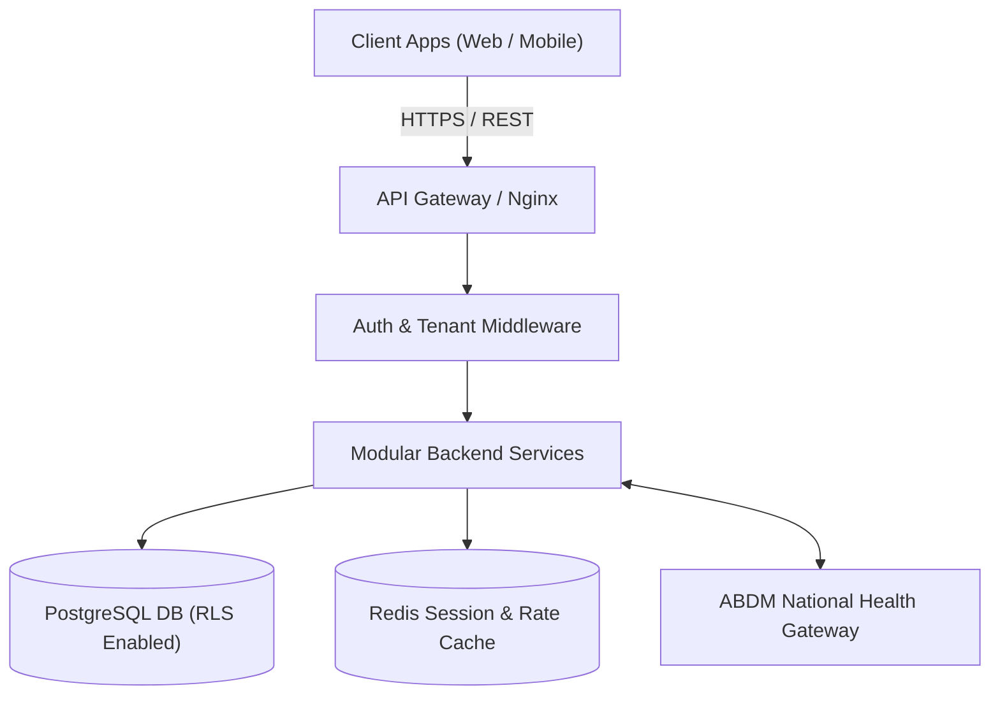

# Hospital Management System (HMS) Architecture Blueprint

<!-- Source: Extracted 1-page summary from Sections 1-4 of full architecture -->

## 1. System Scope & Product Architecture
The Hospital Management System (HMS) is a cloud-native, multi-tenant SaaS platform engineered for clinics, multi-specialty hospitals, and hospital chains in India. The application manages the full patient care lifecycle across 14 specialized role domains.

### Key Architectural Principles
- **Zero-Trust Multi-Tenancy**: Shared PostgreSQL database using Row-Level Security (RLS) policies scoped by `tenant_id` and `hospital_id`.
- **Interoperability**: Standardized FHIR R4 JSON resources for ABDM (M1, M2, M3) health record exchange.
- **Strict Compliance**: Regulatory alignment with DPDP Act 2023, Telemedicine Guidelines, GST Invoicing, and NABH/NABL accreditation standards.
- **Modular Monolith**: Single deployment unit divided into decoupled domain modules (`backend/src/modules/*`).

---

## 2. Domain & Ownership Overview
The system encompasses ~110 database tables organized across 14 primary domains:
1. **Super Admin**: Tenants, Subscriptions, Feature Flags, Global Masters (Drug, ICD-10, SNOMED, LOINC).
2. **Hospital Admin & Identity**: Hospitals, Departments, Wards, Beds, Users, Roles, Permissions, HR, Payroll, Doctor Payouts.
3. **Patient & Reception**: Patient Demographics, Identifiers (UHID, ABHA), Appointments, Queue Tokens.
4. **Clinical & EMR**: Encounters, Vitals, SOAP Notes, Diagnoses, Prescriptions, Referrals, Teleconsultation.
5. **Inpatient & OT**: Admissions, Bed Transfers, MAR, Shift Handovers, OT Bookings, Anesthesia Notes.
6. **Pharmacy & Diagnostics**: Inventory, Stock Batches, Dispenses, Lab/Radiology Orders & Reports, PACS.
7. **Billing & Compliance**: Invoices, Payments, GST Engine, TPA Claims, Consent Artefacts, Audit Logs.

### Inpatient workflow status

The IPD/nursing routes currently demonstrate the intended UI but are **not a shared clinical workflow**: their ward occupancy, vitals, MAR, and prescription hand-offs are fixture or browser-storage based. Production implementation must follow the authoritative placement, orders, MAR, ward-round, event, and RBAC design in [inpatient_workflow_architecture.md](inpatient_workflow_architecture.md). In particular, a bed transfer is an atomic server transaction and a signed inpatient order creates nurse-visible MAR tasks for the patient's current ward/bed.

### Hospital-wide paperless operating model

The system's target scope is an end-to-end Indian hospital operating model: patient access and OPD, emergency, ADT/capacity, wards/ICU, medication/pharmacy, diagnostics, OT, blood bank where in scope, billing/TPA, discharge, quality, facilities, HR and compliance. The evidence-based module boundaries, ownership rules, India-specific integration baseline, data invariants, frontend requirements and release gates are defined in [india_paperless_hospital_blueprint.md](india_paperless_hospital_blueprint.md). This blueprint supersedes any interpretation of the existing role pages as production-ready workflows.

---

## 3. High-Level System Topology

---

> For the complete database schema DDL, see [erd.md](file:///home/pawan/Desktop/hospital/hms-project/docs/erd.md).  
> For the complete blueprint source text, see [architecture_full.md](file:///home/pawan/Desktop/hospital/hms-project/docs/architecture_full.md).
