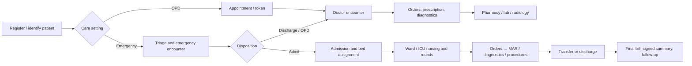
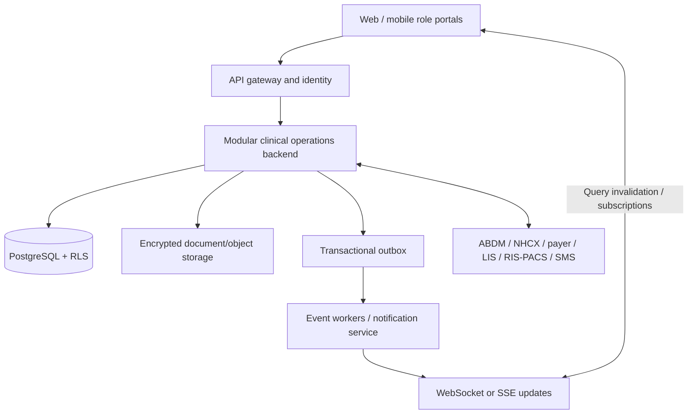

# India Paperless Hospital Blueprint

## Executive decision

This product should be rebuilt as a hospital operating system, not as a collection of role dashboards. The source of truth must be a shared, auditable patient timeline that follows a person from pre-registration through OPD, emergency or IPD care, medication administration, diagnostics, billing, discharge, and post-discharge follow-up. A browser-only prototype cannot be used for clinical operations.

NABH's hospital accreditation programme evaluates the whole institution, including continuity of care, medication management, infection control, patient rights, safety/quality, and information management. Its current information-management material calls for accurate, timely and secure records, standardised documentation, confidentiality, security, and information to support clinical and managerial decisions.^1^2 The scope below is therefore an operational baseline, not a list of optional screens.

## What an Indian hospital needs to digitise

| Care or support flow | Paperless capability required | Primary users |
|---|---|---|
| Master data and readiness | Hospital/branch, department, service catalogue, wards, rooms, beds, staff credentials, duty rosters, payer contracts, tariffs, forms and consent templates | Hospital admin, HR, quality |
| Patient access | UHID/ABHA-aware search, demographic registration, consent, appointment, walk-in token, queue, referral, eligibility and deposit collection | Reception, call centre, patient |
| Emergency | Triage, time-stamped assessment, resuscitation record, emergency orders, observation, medico-legal flags, disposition to discharge/OPD/IPD/OT | Emergency physician, nurse, reception |
| OPD | Appointment, arrival, consultation, diagnosis, orders, e-prescription, procedure charge capture, follow-up and patient instructions | Reception, doctor, nurse, pharmacy |
| Admission–transfer–discharge (ADT) | Admission request, clinical/payer clearance, bed assignment, transfer, room/bed status, discharge planning, final bill, summary and follow-up | Admission desk, nursing supervisor, doctor, billing |
| Ward/ICU | Bed board by ward/shift, nursing assessment, vitals/flowsheets, intake-output, care plan, handover, escalation, restraint/fall/pressure-injury documentation | Nurses, doctors, quality |
| Medication | Signed orders, allergy/interaction checks, formulary, pharmacy verification, dispense/issue, barcode-assisted MAR, controlled-drug register, returns and reconciliation | Doctor, pharmacist, nurse |
| Diagnostics | Order entry, specimen collection and chain of custody, lab worklists, result verification, critical-value escalation, radiology scheduling/reporting, PACS links | Doctor, nurse, phlebotomist, lab, radiology |
| Procedures/OT | Pre-op assessment/consent, checklist, anaesthesia, implant/consumable traceability, intra-op notes, recovery and procedure charge capture | Surgeon, anaesthesia, OT nurse, billing |
| Blood bank and infection control | Component request/issue/return traceability, transfusion reaction, culture/AMR surveillance, HAI bundles and isolation management | Blood bank, nurse, microbiology, infection control |
| Revenue cycle | Estimate/package, advance, charge capture at source, pharmacy/lab/OT/IPD charges, payer pre-authorisation, claim, denial and reconciliation | Billing, TPA, finance |
| Discharge and continuity | Medication reconciliation, signed discharge summary, patient education, referrals, follow-up, record sharing, mortality/readmission and feedback tracking | Doctor, nurse, pharmacy, patient relations |
| Governance | Incident reporting, complaints/grievances, clinical audit, mortality review, KPI dashboards, document control, retention, access audit and downtime procedures | Quality, compliance, leadership |

The prescription/dispensing module must preserve patient, prescriber, drug, quantity and supply traceability; the Drugs Rules specify record requirements including separate Schedule H1 records retained for three years and batch/expiry particulars for applicable supply records.^3 This means inventory, dispensing, MAR and billing cannot be independent lists.

## Patient journey and ownership

### Non-negotiable ownership boundaries

- Hospital Admin owns physical configuration: ward, room, bed, service, tariff and role policy.
- Reception owns demographic accuracy, appointments, arrival, token and admission initiation; it does not create clinical documentation.
- Admission desk or nursing supervisor confirms placement and transfer. A bedside nurse may request a transfer, but may not silently alter historical occupancy.
- Doctor owns assessment, diagnosis, order authoring, amendment/discontinuation and discharge/round sign-off.
- Nurse owns assessment, vitals, care-plan execution, nursing notes, handover and MAR outcome—not prescribing.
- Pharmacy owns verification, dispense/issue/return and stock/batch traceability; a pharmacist does not modify the doctor's signed order.
- Billing owns financial approval, invoices and claims, but clinical charge capture originates in the care event that occurred.

## India-specific compliance and interoperability baseline

1. **ABDM.** Register facilities in HFR and healthcare professionals in HPR where applicable; treat ABHA as an optional patient identifier, not the sole identity. ABDM describes HPR as a verified registry for doctors, nurses, paramedics and allied professionals, and HFR registration provides a unique facility identity and discoverability.^4^5 Integrations must begin in the ABDM sandbox and pass functional testing and a security assessment before production access.^6
2. **Clinical interoperability.** Model the internal record around FHIR R4-compatible resources and coding: Patient, Encounter, Appointment, Practitioner, Organization, Location, Observation, AllergyIntolerance, Condition, MedicationRequest, MedicationAdministration, DiagnosticReport, ServiceRequest, Procedure, Invoice and DocumentReference. The Government's EHR Standards for India establish the national standards context for electronic records.^7
3. **Privacy and data protection.** DPDP applies to digital personal data collected in India, including data digitised after being collected non-digitally. It requires a lawful basis, notice for consent, reasonable security safeguards, breach intimation, data-principal rights and retention/erasure handling subject to legal obligations.^8 The 13 November 2025 notification stages commencement; implementation timing must be tracked by counsel rather than assumed.^9
4. **Accreditation and clinical safety.** Build the audit and quality modules against the current NABH 6th Edition standards and the hospital's accreditation scope. The standard itself, licence rules and state-specific requirements must be reviewed by the hospital's legal, quality and clinical leadership before go-live.^1^10
5. **State and specialty variation.** Clinical Establishments registration, state pharmacy rules, medico-legal registers, blood bank, biomedical waste, PNDT, transplant, insurance/TPA and specialty programmes vary by location and service. Treat them as configurable compliance packs, not hard-coded universal workflow.

## Target architecture

### Architectural shape

Start with a modular monolith—not microservices—with a transactional PostgreSQL core, object storage for documents, Redis for short-lived cache/jobs, and a transactional outbox. Split services only after a real scaling or regulatory isolation need appears. Each request must establish tenant, hospital, authenticated user, role and permitted location context before querying data.

### Required bounded modules

| Module | Authoritative records | Emits / consumes |
|---|---|---|
| Identity and organisation | user, role, practitioner, facility, department, ward, room, bed, staff-location assignment | identity.changed |
| Patient access | patient, identifier, consent, appointment, queue token, referral | patient.registered, arrival.recorded |
| Clinical record | encounter, problem, allergy, note, diagnosis, round note, document | encounter.signed, diagnosis.changed |
| ADT and capacity | admission, bed occupancy, transfer, discharge disposition | admission.placed, bed.transfer.completed, admission.discharged |
| Nursing | assessment, vital, intake-output, nursing note, handover, care task | vital.recorded, handover.signed |
| Orders and medication | order, order version/item, medication schedule task, MAR administration, pharmacy verification/dispense | order.signed, mar.due, mar.recorded |
| Diagnostics | service request, specimen, accession, result, critical alert, imaging study/report | result.verified, result.critical |
| Perioperative and blood | OT booking/checklist, anaesthesia, procedure, implant, blood request/issue/transfusion | procedure.completed, transfusion.reaction |
| Revenue cycle | estimate, charge, invoice, receipt, payer auth, claim, denial | charge.posted, claim.submitted |
| Quality/compliance | incident, infection surveillance, audit, consent, disclosure, retention hold | incident.opened, audit.logged |
| Integration | ABDM/FHIR bundles, NHCX/payer adapters, HL7/DICOM adapters, message delivery | integration.succeeded/failed |

### Data rules that prevent clinical errors

- A patient has one durable internal UHID per tenant/hospital policy. External identifiers, including ABHA, remain versioned identifiers with verification status.
- A bed is a physical `Location` under a room and ward. `bed_occupancies`, not a `patient_name` column on beds, is the authoritative time-bounded assignment.
- One active occupancy is permitted per bed and per active admission. Admission and transfer commands lock both affected beds and write the admission, occupancy, audit row and outbox event in one transaction.
- Medication orders are immutable once signed. Amendments/discontinuations create a version and reconcile the remaining schedule tasks. The MAR records the administration outcome, actual user/time, reason/override and barcode evidence.
- A nurse's worklist resolves the current ward/bed and shift assignment from server data. When a patient transfers, the task follows the active occupancy for visibility but retains original clinical history.
- Every clinical, financial and access change carries author, timestamp, tenant, hospital, source and correlation ID. Do not use browser storage as a system of record.

## Frontend architecture required before building screens

The current frontend should be treated as a design prototype. Replace fixture/local-storage state by route-scoped TanStack Query hooks backed by Zod-validated API responses. Each clinical page must handle loading, empty, error, stale-data and permission states; it must never display a successful clinical action until the server returns a committed record.

Build these shared, non-business primitives first: patient banner with two identifiers, allergy/alert strip, active location badge, timeline/audit viewer, order-status chip, offline/read-only banner and permission-denied state. Keep role-specific workflows inside their role modules. Patient data shown in list views must be minimum necessary; Aadhaar must remain masked.

Priority role pages after the APIs exist:

1. Reception: patient search/registration, appointment/token, admission initiation.
2. Admission desk/nursing supervisor: live capacity, placement, transfer request/acceptance and discharge readiness.
3. Nurse: ward-shift worklist, patient chart, vitals, nursing notes, barcode MAR and handover.
4. Doctor: OPD queue, ward/bed round list, chart, signed orders and discharge sign-off.
5. Pharmacy/lab/radiology: verified worklists, result/dispense completion and critical-alert acknowledgement.
6. Billing/TPA/quality: charge exceptions, claims and immutable audit/quality reporting.

## Delivery plan

| Release | Outcome | Must be complete before progressing |
|---|---|---|
| 0 — Safety foundation | NestJS service, PostgreSQL migrations, tenant/hospital RLS, identity, audit/outbox, consent, API envelope, Zod contracts, test data | Threat model, backup/restore rehearsal, audit/event tests |
| 1 — Patient access and OPD | Patient identity, appointments/tokens, encounter, signed prescription, charge capture | No clinical state in localStorage; role and tenant isolation tests |
| 2 — ADT and nursing | Admission, live capacity, occupancy/transfer, nurse worklist, vitals, notes, handover | Concurrent transfer tests; shift/ward authorisation; downtime workflow |
| 3 — Orders, pharmacy and diagnostics | Inpatient order/MAR, pharmacy, lab/RIS integration, critical results | Five-right medication controls and reconciliation tests |
| 4 — OT, discharge and revenue | OT, blood/implant traceability where in scope, discharge, claims/TPA, patient portal | End-to-end admission-to-discharge scenario and financial reconciliation |
| 5 — Interoperability and quality | ABDM sandbox, FHIR/document sharing, dashboards, NABH evidence pack | Security assessment, clinical governance sign-off and production-readiness review |

## Go-live gates

Do not migrate a ward or department because a screen looks complete. Require: clinical workflow sign-off; super-user training; paper/downtime and recovery procedures; data migration reconciliation; role/ward access tests; load tests; backup restoration; audit-log review; medication safety testing; privacy/consent review; and a measured pilot with a rollback plan. Run the first ward in parallel observation only until the hospital's clinical governance group accepts the results.

## Sources

1. National Accreditation Board for Hospitals & Healthcare Providers. [Hospitals Accreditation Programme (HCO)](https://nabh.co/programmes/hospitals-accreditation-programme-hco/). Accessed 12 September 2026.
2. National Accreditation Board for Hospitals & Healthcare Providers. [HCO Full Accreditation Masterclass: 6th Edition, Chapter 10 — Information Management System](https://nabh.co/training/hco-full-accreditation-masterclass-6th-edition-chapter-10-information-management-system-ims/). Accessed 12 September 2026.
3. Central Drugs Standard Control Organization. [Drugs Rules, 1945 (consolidated document)](https://cdsco.gov.in/opencms/resources/UploadCDSCOWeb/2022/drug_rules/Drugs%20Rules%201945_2024%2009.09.2024.pdf). Accessed 12 September 2026.
4. National Health Authority. [Healthcare Professionals Registry](https://abdm.gov.in/healthcare-professionals). Accessed 12 September 2026.
5. National Health Authority. [Health Facility Registry registration benefits](https://abdm.gov.in/strapicms/uploads/Standee_HFR_Regsitration_and_its_Benefits_b586cf1e0e.pdf). Accessed 12 September 2026.
6. National Health Authority. [ABDM FAQs — Sandbox and production integration](https://abdm.gov.in/faqs). Accessed 12 September 2026.
7. Ministry of Health and Family Welfare. [Electronic Health Record Standards for India, 2016](https://www.mohfw.gov.in/sites/default/files/EMR-EHR_Standards_for_India_as_notified_by_MOHFW_2016_0.pdf). Accessed 12 September 2026.
8. Ministry of Law and Justice. [Digital Personal Data Protection Act, 2023](https://www.meity.gov.in/static/uploads/2024/06/2bf1f0e9f04e6fb4f8fef35e82c42aa5.pdf). Accessed 12 September 2026.
9. Ministry of Electronics and Information Technology. [Notification G.S.R. 843(E), 13 November 2025](https://www.meity.gov.in/static/uploads/2025/11/c56ceae6c383460ca69577428d36828b.pdf). Accessed 12 September 2026.
10. National Accreditation Board for Hospitals & Healthcare Providers. [NABH Hospital Accreditation Standards, 6th Edition, January 2025](https://portal.nabh.co/images/Standards/NABH%20Hospital%20Accreditation%20Standard%206th%20Edition%20January%202025.pdf). Accessed 12 September 2026.
