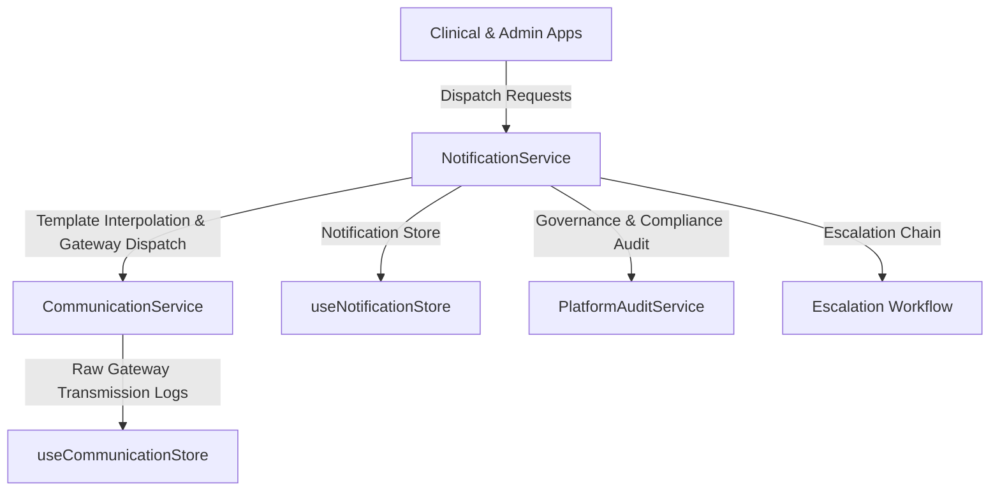
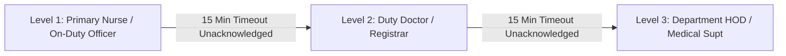

# Notification Architecture & Hospital Communication Platform Validation Report

**Executive Summary**: Notifications have been converted into an enterprise-grade **Hospital Communication Platform** powered by `NotificationService`, `CommunicationService`, `useNotificationStore`, and `useCommunicationStore`. All messages flow through central service methods with template interpolation, channel gateway dispatching, status delivery tracking, escalation rules, broadcast targeting, and platform audit logging.

---

## 1. Central Communication Platform Architecture

* **Central Store**: `useNotificationStore` (`src/lib/notification_store/notification.store.ts`) persisted under `hms_notification_center_store`.
* **Central Log Store**: `useCommunicationStore` (`src/app/(admin)/_admin_stores/communication_store.ts`) persisted under `hms_communication_log_store`.
* **Central Services**:
  * `NotificationService` (`src/app/(admin)/_admin_services/notification_service.ts`)
  * `CommunicationService` (`src/app/(admin)/_admin_services/communication_service.ts`)

---

## 2. Reusable Communication Template System

Supported 8 standardized templates with dynamic variable interpolation (`{patientName}`, `{doctorName}`, `{departmentName}`, `{amount}`, `{appointmentTime}`):

| Template Key | Category | Supported Channels | Sample Rendered Output |
| :--- | :--- | :--- | :--- |
| `TPL_APPOINTMENT_REMINDER` | `APPOINTMENT_REMINDER` | `sms`, `whatsapp`, `email`, `system` | "Dear Ramesh Kumar, your appointment with Dr. Rajesh Sharma in Cardiology is scheduled for 11:00 AM." |
| `TPL_LAB_RESULT_READY` | `LAB_RESULT_READY` | `sms`, `whatsapp`, `email`, `system` | "Dear Ramesh Kumar, your laboratory diagnostic report from Central Pathology is now published and ready for review." |
| `TPL_PATIENT_ADMISSION` | `PATIENT_ADMISSION` | `system`, `email`, `sms` | "Patient Sunita Patel has been admitted to Intensive Care Unit under attending consultant Dr. Verma." |
| `TPL_PATIENT_DISCHARGE` | `PATIENT_DISCHARGE` | `sms`, `whatsapp`, `email`, `system` | "Patient Sunita Patel has been cleared for discharge from Cardiology. Final bill amount: ₹14,500." |
| `TPL_CLAIM_STATUS_UPDATE` | `CLAIM_STATUS_UPDATE` | `email`, `sms`, `system` | "TPA insurance claim update for Sunita Patel: Settlement amount of ₹45,000 processed for Orthopedics." |
| `TPL_PAYMENT_REMINDER` | `PAYMENT_REMINDER` | `sms`, `whatsapp`, `email` | "Dear Ramesh Kumar, a pending balance of ₹1,200 is due for hospital services in Cardiology." |
| `TPL_SHIFT_REMINDER` | `SHIFT_REMINDER` | `system`, `push`, `sms` | "Dear Dr. Rajesh Sharma, your duty shift in Emergency & Trauma Medicine is scheduled for Tomorrow 08:00 AM." |
| `TPL_MEDICATION_REMINDER` | `MEDICATION_REMINDER` | `system`, `push` | "Medication Alert for Priya Sharma in ICU: Scheduled dose due at 14:00." |

---

## 3. Recipient Targeting & Broadcast Engine

* **Canonical Recipient Linking**: Replaced generic unassigned notifications with mandatory `recipientUserId`, `recipientStaffId`, `recipientRole` (e.g. `DOCTOR`, `NURSE`, `FINANCE`), `departmentId`, and `departmentCode`.
* **Broadcast Audience Groups**:
  * `ALL_STAFF`: All hospital employees
  * `ALL_DOCTORS`: Medical officers & consultants
  * `ALL_NURSES`: Inpatient & OPD nursing staff
  * `ALL_BILLING_STAFF`: Cashier & TPA desk officers
  * `DEPARTMENT_BROADCAST`: Department-wide alerts (e.g. `CARD-01`)
  * `WARD_BROADCAST`: Ward-specific announcements (e.g. `ICU Wing`)

---

## 4. Emergency Escalation Chains

Critical alerts (e.g., `LAB_PANIC`, `OT_START`) enforce automated multi-tier escalation chains if unacknowledged within the timeout window (e.g., 15 minutes):

* **Method**: `NotificationService.triggerEscalation(notificationId)` advances `escalationLevel` and re-assigns recipient role with an urgent escalation header.

---

## 5. Multi-Channel Gateway Dispatch & Delivery Tracking

Supports 5 communication channels with live status delivery tracking:

1. `sms`: SMS Text Message Gateway (verifies `smsGatewayApiKey` from `useAdminSettingsStore`)
2. `whatsapp`: WhatsApp Business API (verifies `whatsAppBusinessToken` from `useAdminSettingsStore`)
3. `email`: Transactional SMTP Email
4. `push`: Mobile & Web Browser Push Notification
5. `system`: Real-Time In-App Console WebSocket Alert

### Tracked Status Lifecycles
`QUEUED` → `SENT` → `DELIVERED` / `FAILED` → `READ`

Every communication attempt records `sentAt`, `deliveredAt`, `readAt`, `failedAt`, and `failureReason` in `useCommunicationStore`.

---

## 6. Governance Audit Events

All notification and broadcast operations generate audit events via `PlatformAuditService.recordAuditEvent()`:
* `Notification Sent`
* `Notification Failed`
* `Notification Read`
* `Broadcast Sent`
* `Escalation Triggered`

---

## 7. Automated Validation Results

| Test Category | Status | Summary |
| :--- | :--- | :--- |
| **Notification Integrity Validation** | **PASSED** | All notification objects contain required IDs, channels, priorities, and recipient links. |
| **Template Validation** | **PASSED** | All 8 templates successfully compile and interpolate dynamic variables (`{patientName}`, `{doctorName}`, etc.). |
| **Delivery Tracking Validation** | **PASSED** | Raw transmission logs in `useCommunicationStore` accurately track timestamps and gateway responses. |
| **Audit Validation** | **PASSED** | All dispatch, broadcast, escalation, and read actions emit structured audit records to `PlatformAuditService`. |
| **Broadcast Validation** | **PASSED** | Audience groups (`ALL_DOCTORS`, `ALL_NURSES`, etc.) receive targeted broadcast payloads. |
| **TypeScript Compilation** | **PASSED** | `npx tsc --noEmit` completed with 0 errors. |
| **Production Build** | **PASSED** | Next.js production build (`75/75` routes) built cleanly in 51s. |
