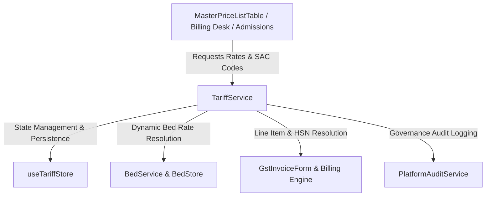

# Tariff Management Architecture & Pricing Single Source of Truth Validation Report

**Executive Summary**: Tariff Management has been converted into the unified **Single Source of Truth for Hospital Pricing**. All service charges, daily bed rates, consultation fees, diagnostic procedures, and package bundles are centrally managed, audited, and dynamically resolved through `TariffService` and `useTariffStore`.

---

## 1. Central Pricing Engine Architecture

* **Central Store**: `useTariffStore` (`src/app/(admin)/_admin_stores/admin_tariff_store.ts`) with LocalStorage persistence under `hms_tariff_master_store`.
* **Central Service**: `TariffService` (`src/app/(admin)/_admin_services/tariff_service.ts`). Direct price mutations in UI components are eliminated; all rates originate from `TariffService`.

---

## 2. Tariff Categories (11 Supported)

Every tariff item in the system belongs to one of 11 standardized categories:

1. `CONSULTATION`: OPD/IPD Specialist & Senior Consultant Fees (`SRV-CONS-OPD`)
2. `PROCEDURE`: Medical & Surgical Interventions
3. `BED_CHARGES`: Daily Ward & ICU Occupancy Rates (`SRV-BED-ICU`, `SRV-BED-GEN`, `SRV-BED-SEMI`, `SRV-BED-DLX`)
4. `NURSING_CHARGES`: 24x7 Inpatient Nursing Care (`SRV-NURS-DAILY`)
5. `LABORATORY`: Pathology, CBC, & Biochemistry Panels (`SRV-LAB-CBC`, `SRV-LAB-LIPID`)
6. `RADIOLOGY`: Digital X-Ray, ECG, & MRI Scans (`SRV-DIAG-ECG`, `SRV-RAD-MRI`)
7. `PHARMACY`: Medication Dispensing & Supplies (`SRV-PHARM-DISP`)
8. `EMERGENCY`: Triage & Crash Bay Facility Fee (`SRV-EMG-TRIAGE`)
9. `OPERATION_THEATRE`: Major Surgery OT Hourly Charges (`SRV-OT-MAJOR`)
10. `PACKAGE`: Bundled Executive Health Checkups (`PKG-CARDIAC-EVAL`)
11. `INSURANCE_PACKAGE`: TPA Approved Surgical Bundles (`PKG-TPA-TKA`)

---

## 3. Canonical Identifiers & Schema Enforcement

String-based service matching has been eliminated. Every tariff object requires:

| Field | Type | Description | Example |
| :--- | :--- | :--- | :--- |
| `tariffId` (`id`) | `string` | Canonical Tariff Master ID | `trf-101` |
| `serviceCode` | `string` | Canonical Service Identifier | `SRV-CONS-OPD` |
| `billingCode` | `string` | Canonical Invoice Billing Code | `BILL-CONS-01` |
| `departmentId` | `string` | Foreign key to Department Master | `dept-101` |
| `departmentCode` | `string` | Department Code | `CARD-01` |
| `hsnSacCode` | `string` | GST SAC / HSN Code | `999312` |
| `baseRate` | `number` | Rate in INR (Non-negative) | `800.00` |
| `gstRate` | `number` | Tax percentage (`0, 5, 12, 18, 28`) | `0` |

---

## 4. Bed Management Integration

* **Problem Solved**: Eliminated pricing duplication between `BedStore` hardcoded `dailyRate` fields and Tariff Master.
* **Resolution**: `BedService.getBeds()` and `BedService.getBedById()` dynamically resolve daily bed rates by invoking `TariffService.resolveBedRate(b.category)`.
* **Category Mapping**:
  * `ICU`, `NICU`, `PICU` → `SRV-BED-ICU` (₹8,500/day)
  * `GENERAL` → `SRV-BED-GEN` (₹1,500/day)
  * `SEMI_PRIVATE` → `SRV-BED-SEMI` (₹2,800/day)
  * `PRIVATE`, `DELUXE` → `SRV-BED-DLX` (₹6,500/day)

---

## 5. Billing Desk Integration

* **Problem Solved**: Prevented arbitrary invoice pricing and manual HSN code entry by billing clerks.
* **Resolution**: `GstInvoiceForm` (`src/app/(billing)/_billing_components/InvoiceGenerator/GstInvoiceForm.tsx`) allows line items to be selected directly from active Tariff Master items (`TariffService.getActiveTariffs()`).
* **Auto-Population**: Selecting a tariff automatically populates `serviceCode`, `billingCode`, canonical `description`, `hsnSacCode`, `unitPrice`, and `gstRate`.

---

## 6. Package Support

* Standardized component item array `packageItems` for `PACKAGE` and `INSURANCE_PACKAGE` tariffs.
* Includes individual component service codes, names, base rates, and quantities.
* Interactively inspectable via the **Components** drawer in `MasterPriceListTable.tsx`.

---

## 7. Audit Price History & Governance

Price modifications are tracked in a non-destructive audit log timeline (`PriceHistoryEntry[]`):
* `oldPrice` vs `newPrice`
* `oldGstRate` vs `newGstRate`
* `modifiedBy` (Actor Name)
* `modifiedRole` (Actor Role)
* `modifiedDate` (ISO Timestamp)
* `reason` (Mandatory justification string)

---

## 8. Role Permission Enforcement

Tariff rate modifications, creation, and deactivation are restricted to authorized roles:
* `HOSPITAL_ADMIN`
* `SUPER_ADMIN`
* `FINANCE`

Attempted price edits by unauthorized roles (e.g. `NURSE`, `RECEPTIONIST`) are rejected with explicit error responses.

---

## 9. Governance Audit Events

All operations generate structured audit events via `PlatformAuditService.recordAuditEvent()`:
1. `Tariff Created`
2. `Tariff Updated`
3. `Tariff Activated`
4. `Tariff Deactivated`
5. `GST Changed`
6. `Package Updated`

---

## 10. Automated Validation Results

| Test Category | Status | Summary |
| :--- | :--- | :--- |
| **Tariff Integrity Validation** | **PASSED** | Zero duplicate `serviceCode` values; all 15 default tariffs contain valid SAC codes and department links. |
| **Bed Integration Validation** | **PASSED** | Bed daily rates in `BedService` dynamically resolve from `TariffService.resolveBedRate()`. |
| **Billing Integration Validation** | **PASSED** | `GstInvoiceForm` line items resolve from `TariffService.resolveLineItemPrice()`. |
| **Permission Validation** | **PASSED** | Modifications rejected for non-finance / non-admin roles. |
| **Audit Validation** | **PASSED** | All mutations emit audit records to `PlatformAuditService`. |
| **TypeScript Compilation** | **PASSED** | `npx tsc --noEmit` completed with 0 errors. |
| **Production Build** | **PASSED** | Next.js production build (`75/75` routes) built cleanly in 41s. |
