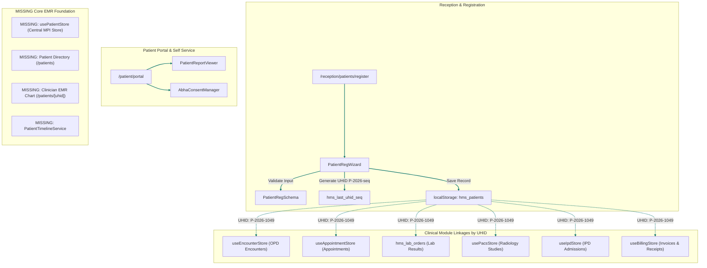
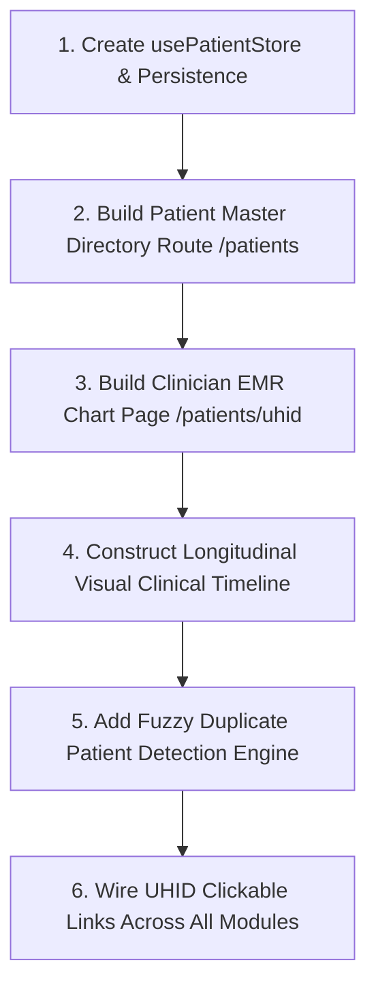

# Patient Master & EMR Foundation Subsystem: Discovery Audit & Dependency Map

## Executive Summary

This document presents a comprehensive **Discovery Audit & Dependency Map** for the **Patient Master & Electronic Medical Record (EMR) Foundation** subsystem of the Hospital Management System (HMS).

The audit reveals that while individual clinical modules (OPD Encounters, Lab Orders, Radiology PACS, IPD Admissions, and Billing) reference a uniform **Universal Health Identification (UHID)** format (`P-2026-${seq}`), the system lacks a **Master Patient Index (MPI) Store** and a **Consolidated Clinician EMR Chart View**:

1. **Absence of Centralized `usePatientStore` / MPI Store**: Patient registration ([PatientRegWizard.tsx](file:///home/pawan/Desktop/hospital/web/src/app/(reception)/_reception_components/PatientRegistration/PatientRegWizard.tsx)) writes raw JSON directly to `localStorage.getItem("hms_patients")`. There is no Zustand store or service handling patient master CRUD operations, search, or filtering.
2. **Missing Longitudinal EMR Chart View**: No route exists for `/patients` (Patient Directory) or `/patients/[uhid]` (Clinician EMR Profile). Clinicians cannot view a patient's complete longitudinal record in a single window.
3. **Fragmented Data Flow Architecture**: Clinical records are isolated in 6 separate stores/storage keys (`hms_patients`, `hms_doctor_encounters_v1`, `hms_lab_orders`, `hms_pacs_store_v1`, `hms_ipd_admissions_store`, `hms_billing_master_store_v1`). No aggregator service unifies these into a single clinical timeline.
4. **Basic Duplicate Detection**: Duplicate checking in `PatientRegWizard.tsx` relies on exact string equality of Phone or Aadhaar against `localStorage` array items. It lacks fuzzy name/DOB matching.

---

## Subsystem Architecture Diagram



---

## Route Inventory

| Route Path | Type | Target Component / File | Status | Technical Description & Identified Gaps |
|---|---|---|---|---|
| `/reception/patients/register` | Page | [src/app/(reception)/patients/register/page.tsx](file:///home/pawan/Desktop/hospital/web/src/app/(reception)/patients/register/page.tsx) | Functional | 3-step Patient Registration Wizard (Demographics, Triage Vitals, TPA Insurance). Generates UHID and saves to `hms_patients`. |
| `/patient/portal` | Page | [src/app/(patient)/portal/page.tsx](file:///home/pawan/Desktop/hospital/web/src/app/(patient)/portal/page.tsx) | Partial Mock | Patient portal displaying Health Records, ABHA linkage, and Active Prescriptions. Uses static header for "Sunil Verma". |
| `/patient/patient` | Page | [src/app/(patient)/patient/page.tsx](file:///home/pawan/Desktop/hospital/web/src/app/(patient)/patient/page.tsx) | Placeholder | Basic title placeholder for patient self-service. |
| `/patients` | Missing | N/A | Missing | Central Patient Directory & Master Search page does not exist. |
| `/patients/[uhid]` | Missing | N/A | Missing | Longitudinal Clinician EMR Chart page with full medical history does not exist. |

---

## Component Inventory

| Component Name | File Path | Scope / Purpose | Observed State & Technical Evaluation |
|---|---|---|---|
| `PatientRegWizard` | [PatientRegistration/PatientRegWizard.tsx](file:///home/pawan/Desktop/hospital/web/src/app/(reception)/_reception_components/PatientRegistration/PatientRegWizard.tsx) | Patient Registration Wizard | Multi-step form container. Validates input via `PatientRegSchema`, generates sequential UHID, and checks duplicates in `hms_patients`. |
| `DemographicsStep` | [Steps/DemographicsStep.tsx](file:///home/pawan/Desktop/hospital/web/src/app/(reception)/_reception_components/PatientRegistration/Steps/DemographicsStep.tsx) | Demographics Input | Captures Full Name, Gender, DOB, Phone, Email, Aadhaar, Emergency Contact, and Address. |
| `VitalsStep` | [Steps/VitalsStep.tsx](file:///home/pawan/Desktop/hospital/web/src/app/(reception)/_reception_components/PatientRegistration/Steps/VitalsStep.tsx) | Registration Triage Vitals | Captures BP, Pulse, Temperature, SpO2, Weight, and Height. |
| `InsuranceStep` | [Steps/InsuranceStep.tsx](file:///home/pawan/Desktop/hospital/web/src/app/(reception)/_reception_components/PatientRegistration/Steps/InsuranceStep.tsx) | TPA Insurance Input | Captures Insurance Provider, Policy Number, Sum Insured, and Pre-Approval status. |
| `AbhaConsentManager` | [AbhaLinkage/AbhaConsentManager.tsx](file:///home/pawan/Desktop/hospital/web/src/app/(patient)/_patient_components/AbhaLinkage/AbhaConsentManager.tsx) | ABHA Consent Manager | Displays linked ABHA address (`sunil.verma@abdm`), consent history, and revoked consents. |
| `PatientReportViewer` | [HealthRecords/PatientReportViewer.tsx](file:///home/pawan/Desktop/hospital/web/src/app/(patient)/_patient_components/HealthRecords/PatientReportViewer.tsx) | Document Downloads | Displays table of downloadable e-Prescription, Lab Report, and GST Invoice PDFs. |

---

## Store Inventory

| Store Name | Storage Key / Scope | Managed State | Missing Elements & Deficiencies |
|---|---|---|---|
| **`usePatientStore`** | **MISSING** | `patients[]` | **CRITICAL MISSING STORE**. No Zustand store manages Master Patient Index (MPI). Patient records are stored as un-typed raw JSON in `localStorage.getItem("hms_patients")`. |
| `useEncounterStore` | `hms_doctor_encounters_v1` | `encounters[uhid]` | Manages OPD Encounters, SOAP notes, ICD-10 diagnoses, and prescription orders per patient UHID. |
| `usePacsStore` | `hms_pacs_store_v1` | `studies[]` | Manages radiology studies (`CR`, `CT`, `MRI`, `US`, `ECG`) and radiologist reports per patient UHID. |
| `useIpdStore` | `hms_ipd_admissions_store` | `admissions[]` | Manages inpatient admissions, ward placement, bed numbers, and initial deposits per patient UHID. |
| `useBillingStore` | `hms_billing_master_store_v1` | `invoices[]`, `advanceDeposits[]` | Manages invoices, payment receipts, credit notes, and advance deposits per patient UHID. |
| `useAppointmentStore` | `hms_appointments_store_v1` | `appointments[]` | Manages OPD appointments, slots, token numbers, and doctor assignment per patient UHID. |

---

## Service Inventory

| Service Class | File Path | Operations | Limitations & Missing Logic |
|---|---|---|---|
| **`PatientService`** | **MISSING** | N/A | No service exists to query patient master records, execute search filters, handle duplicate detection, or compile longitudinal EMR histories. |
| `EncounterService` | [encounter_service.ts](file:///home/pawan/Desktop/hospital/web/src/app/(doctor)/_doctor_services/encounter_service.ts) | `getOrCreateEncounter()`, `signAndLockEncounter()` | Manages consultation encounters and dispatches prescriptions/labs/radiology by UHID. |
| `PacsService` | [pacs_service.ts](file:///home/pawan/Desktop/hospital/web/src/app/(pacs)/_pacs_services/pacs_service.ts) | `dispatchOrderFromEncounter()`, `finalizeReport()` | Manages radiology imaging orders, DICOM studies, and report sign-offs by UHID. |
| `BedService` | [bed_service.ts](file:///home/pawan/Desktop/hospital/web/src/app/(admin)/_admin_services/bed_service.ts) | `allocateBed()`, `releaseBed()`, `transferBed()` | Manages physical bed placement and ward transfers for admitted patients by UHID. |

---

## Data Flow Map

```mermaid
sequenceDiagram
    autonumber
    actor Patient
    actor Receptionist
    participant Reg as PatientRegWizard
    participant LS as localStorage (hms_patients)
    participant Appt as useAppointmentStore
    actor Doctor
    participant Enc as useEncounterStore
    participant Pacs as usePacsStore
    participant Ipd as useIpdStore
    participant Bill as useBillingStore

    Receptionist->>Reg: Complete Demographics & Registration
    Reg->>LS: Save patient record (UHID: P-2026-1049)
    Receptionist->>Appt: Book OPD Appointment for P-2026-1049
    Doctor->>Enc: Open Consultation & Sign Encounter for P-2026-1049
    Enc->>Pacs: Dispatch Radiology Orders for P-2026-1049
    Enc->>Ipd: Admit Patient for P-2026-1049 (if inpatient required)
    Enc->>Bill: Generate Outpatient Invoice for P-2026-1049
    
    CRITICAL Over LS,Bill: Data stored in 5 separate stores linked only by UHID string! No central EMR view aggregates this data.
```

---

## Dependency Map

```mermaid
graph TD
    subgraph Registration Layer
        RegWizard[PatientRegWizard] -->|1. Generate UHID| UhidSeq[hms_last_uhid_seq]
        RegWizard -->|2. Save Demographics| PatientLS["localStorage: hms_patients"]
    end

    subgraph Clinical Module Linkage (UHID Foreign Key)
        PatientLS -.->|UHID| ApptStore[useAppointmentStore]
        PatientLS -.->|UHID| EncStore[useEncounterStore]
        PatientLS -.->|UHID| LabOrders["localStorage: hms_lab_orders"]
        PatientLS -.->|UHID| PacsStore[usePacsStore]
        PatientLS -.->|UHID| IpdStore[useIpdStore]
        PatientLS -.->|UHID| BillStore[useBillingStore]
    end

    subgraph MISSING Central Abstractions
        MPI[MISSING: usePatientStore / MPI Store] -.->|Should Manage| PatientLS
        EMRChart[MISSING: Clinician EMR Chart View /patients/uhid] -.->|Should Aggregate| ApptStore & EncStore & LabOrders & PacsStore & IpdStore & BillStore
    end
```

---

## Integration Matrix

| Subsystem Integration Item | Primary Identifier | Storage Location | Current Integration Status | Identified Gaps |
|---|---|---|---|---|
| **1. Master Patient Index (MPI)** | `uhid` (`P-2026-${seq}`) | `localStorage: hms_patients` | Partial | Un-typed localStorage array; no central Zustand store. |
| **2. Patient Demographics** | `uhid` | `PatientRegInput` | Implemented | Captured via `PatientRegWizard.tsx` (Demographics Step). |
| **3. UHID / MRN Architecture** | `uhid` | `hms_last_uhid_seq` | Implemented | Sequential counter starting at `1060`. MRN is merged with UHID. |
| **4. Duplicate Detection** | `phone` / `aadhaarNumber` | `PatientRegWizard.tsx` | Partial | Exact string matching in `localStorage`; lacks fuzzy matching. |
| **5. ABHA Linkage** | `abhaId` / `abhaAddress` | `AbhaConsentManager.tsx` | Partial | Captures ABHA ID (`sunil.verma@abdm`); simulated consent flow. |
| **6. Appointment Linkage** | `uhid` | `useAppointmentStore` | Implemented | `AppointmentRecord.uhid` matches patient master. |
| **7. Encounter Linkage** | `uhid` | `useEncounterStore` | Implemented | `ClinicalEncounter.uhid` matches patient master. |
| **8. Prescription Linkage** | `uhid` | `ClinicalEncounter.prescriptions` | Implemented | Prescriptions stored inside encounter object & pharmacy queue. |
| **9. Laboratory Linkage** | `uhid` | `hms_lab_orders` | Implemented | `LabResultRecord.uhid` matches patient master. |
| **10. Radiology Linkage** | `uhid` | `usePacsStore` | Implemented | `RadiologyStudy.uhid` matches patient master. |
| **11. ADT / Inpatient Linkage**| `uhid` | `useIpdStore` / `useBedStore` | Implemented | `IpdAdmissionRecord.uhid` and `HospitalBed.currentUhid` match patient master. |
| **12. Billing Linkage** | `uhid` | `useBillingStore` | Implemented | `InvoiceRecord.patientUhid` & `AdvanceDepositRecord.patientUhid` match patient master. |
| **13. Document Management** | `uhid` | `PatientReportViewer.tsx` | Partial | Static PDF download triggers for eRx, Lab, and Invoice. |
| **14. Timeline Architecture** | `uhid` | **MISSING** | **Missing** | No longitudinal timeline component aggregates events. |
| **15. Mobile Responsiveness** | Breakpoint Styles | `PatientRegWizard` & `Portal` | Implemented | Responsive Ant Design steps and Tailwind grids. |
| **16. Demo Readiness** | Entire Subsystem | N/A | **At Risk** | No clinician EMR profile page (`/patients/[uhid]`) exists to demonstrate holistic patient history. |

---

## Demo Risks

> [!WARNING]
> **High Risk 1: Absence of a Clinician EMR Patient Profile Page**
> Hospital evaluators will expect to click a patient's name or UHID to view their complete medical history. Currently, clicking a UHID in Doctor Queue, PACS Worklist, IPD Ward Matrix, or Billing Table does nothing because no `/patients/[uhid]` route exists.

> [!WARNING]
> **High Risk 2: Patient Master Data Fragmentation**
> Because patient records are saved directly in `localStorage.getItem("hms_patients")` without a fallback Zustand store seed manager, clearing browser cache deletes all newly registered patients.

> [!WARNING]
> **High Risk 3: Missing Longitudinal Clinical Timeline**
> Clinicians cannot view a chronological sequence of a patient's care journey (Registration $\rightarrow$ OPD Consultation $\rightarrow$ Lab/Radiology Orders $\rightarrow$ IPD Admission $\rightarrow$ Discharge Summary).

---

## Recommended Fix Order



### Phase 1: Master Patient Index & Patient Directory (Critical)
1. **Create `usePatientStore.ts`**: Implement Zustand store with `persist` middleware using key `hms_patients_master_store_v1`. Seed default patients (`P-2026-1049`, `P-2026-1052`, `P-2026-1058`, `P-2026-1062`, `P-2026-1065`) and provide methods (`addPatient`, `searchPatients`, `getPatientByUhid`).
2. **Build `/patients` Directory Page**: Create patient master search and directory table with quick links to registration and EMR profile views.
3. **Refactor `PatientRegWizard.tsx`**: Replace raw `localStorage` calls with `usePatientStore.getState().addPatient()`.

### Phase 2: Longitudinal EMR Chart & Timeline (High Priority)
4. **Build `/patients/[uhid]` EMR Chart Page**: Implement comprehensive clinician profile view tabbed into Overview, Encounters, Lab Reports, Radiology Scans, IPD Admissions, and Billing History.
5. **Build `PatientClinicalTimeline` Component**: Create chronological visual timeline aggregating data from `useEncounterStore`, `hms_lab_orders`, `usePacsStore`, `useIpdStore`, and `useBillingStore`.
6. **Wire Universal UHID Hyperlinks**: Make all UHIDs clickable across Doctor Queue, IPD Ward Matrix, PACS Worklist, Lab Review Inbox, and Billing tables, linking directly to `/patients/[uhid]`.
