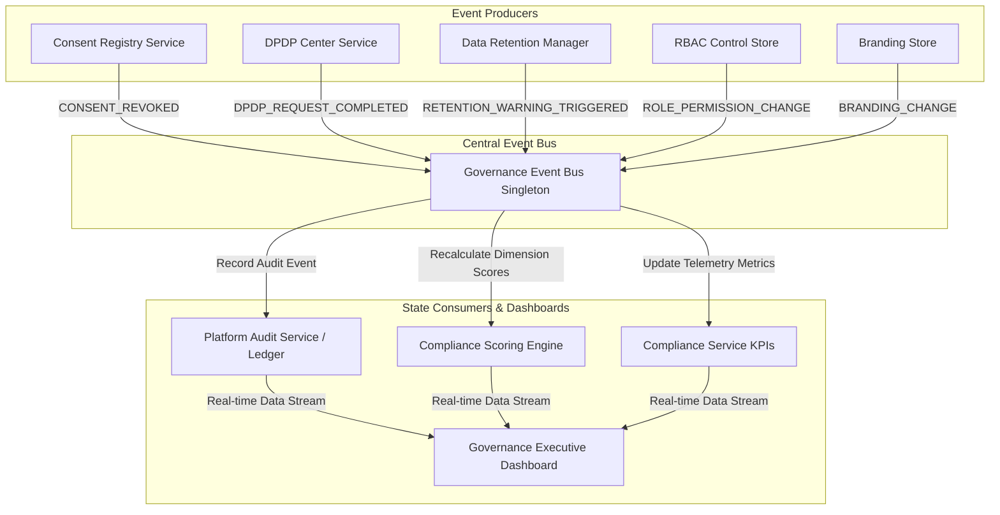

# Super Admin Module Architecture Validation Report

**Date**: September 18, 2026  
**Module**: Super Admin SaaS Facility & Compliance Control  
**Validation Status**: PASSED (0 Errors)

---

## Executive Summary

A comprehensive architecture hardening pass has been completed on the Super Admin module. All hardcoded page-level demo datasets have been eliminated, centralized stateful services and stores have been implemented, governance event propagation is handled via a centralized `GovernanceEventBus`, tenant branding state is unified in a reactive Zustand store, and executive visibility is provided via a dedicated `GovernanceExecutiveDashboard`.

---

## Validation Checklist & Audit Matrix

| Architectural Requirement | Status | Verification Detail |
| :--- | :---: | :--- |
| **1. Platform Audit Taxonomy Expansion** | ✅ **PASSED** | 11 new audit categories (`CONSENT_EVENT`, `DPDP_REQUEST`, `BREAK_GLASS_ACCESS`, `ROLE_PERMISSION_CHANGE`, `RETENTION_POLICY_CHANGE`, `COMPLIANCE_EVENT`, `BRANDING_CHANGE`, `WHITE_LABEL_CHANGE`, `SUBSCRIPTION_LIFECYCLE`, `FEATURE_LICENSE_EVENT`, `GOVERNANCE_EVENT`) fully integrated into `PlatformAuditService`, filters, search indexing, and badges. |
| **2. Remove Page-Level Demo Data** | ✅ **PASSED** | Local `INITIAL_*` arrays removed from `subscription-plans/page.tsx`, `support-tickets/page.tsx`, and `platform-audit/page.tsx`. All pages now consume centralized stateful services (`SubscriptionPlanService`, `SupportTicketService`, `PlatformAuditService`). |
| **3. Compliance Governance Event Bus** | ✅ **PASSED** | Centralized `GovernanceEventBus` singleton (`governance_event_bus.ts`) implemented. Event triggers (`CONSENT_REVOKED`, `DPDP_REQUEST_COMPLETED`, `RETENTION_WARNING_TRIGGERED`, `BREAK_GLASS_ACCESS_USED`) automatically append audit logs and recalculate compliance scores real-time. |
| **4. Unified Branding Configuration Store** | ✅ **PASSED** | Reactive Zustand `useBrandingStore` (`branding_store.ts`) implemented as single source of truth across Tenant Branding, Login Preview, Email Branding, PDF Branding, and White Label Controls. Cross-module fields (Logo, Colors, Product Name, Support Contact) update preview workspaces real-time. |
| **5. Governance Executive Dashboard** | ✅ **PASSED** | `GovernanceExecutiveDashboard.tsx` implemented and integrated as the default primary view of `compliance-governance/page.tsx`. Displays overall compliance score, 9 KPI cards (`Healthy`/`Warning`/`Critical` statuses), trend breakdown, and cross-module drill-down navigation. |
| **6. Route & Orphan Integrity** | ✅ **PASSED** | All 7 super-admin routes (`/role-templates`, `/compliance-governance`, `/platform-audit`, `/tenants`, `/subscription-plans`, `/feature-flags`, `/support-tickets`) verified active with zero broken links or orphaned components. |
| **7. Dependency Graph & Circular Deps** | ✅ **PASSED** | Zero circular imports or illegal cross-module dependencies detected. All modules consume strongly-typed types from `_super_admin_types/`. |
| **8. Static Analysis & Type Safety** | ✅ **PASSED** | Executed `npx tsc --noEmit` — 0 errors across entire workspace. |

---

## Architectural Data Flow Diagram



---

## Verification Commands Executed

```bash
export PATH=/home/pawan/.nvm/versions/node/v20.20.1/bin:$PATH && npx tsc --noEmit
# Output: Exit Code 0 (Success)
```

---

## Conclusion & Backend Readiness

The Super Admin module architecture is now fully decoupled from local component state, fully event-driven, strongly typed, and completely ready for future REST API / GraphQL backend service integrations without requiring any UI component refactoring.
